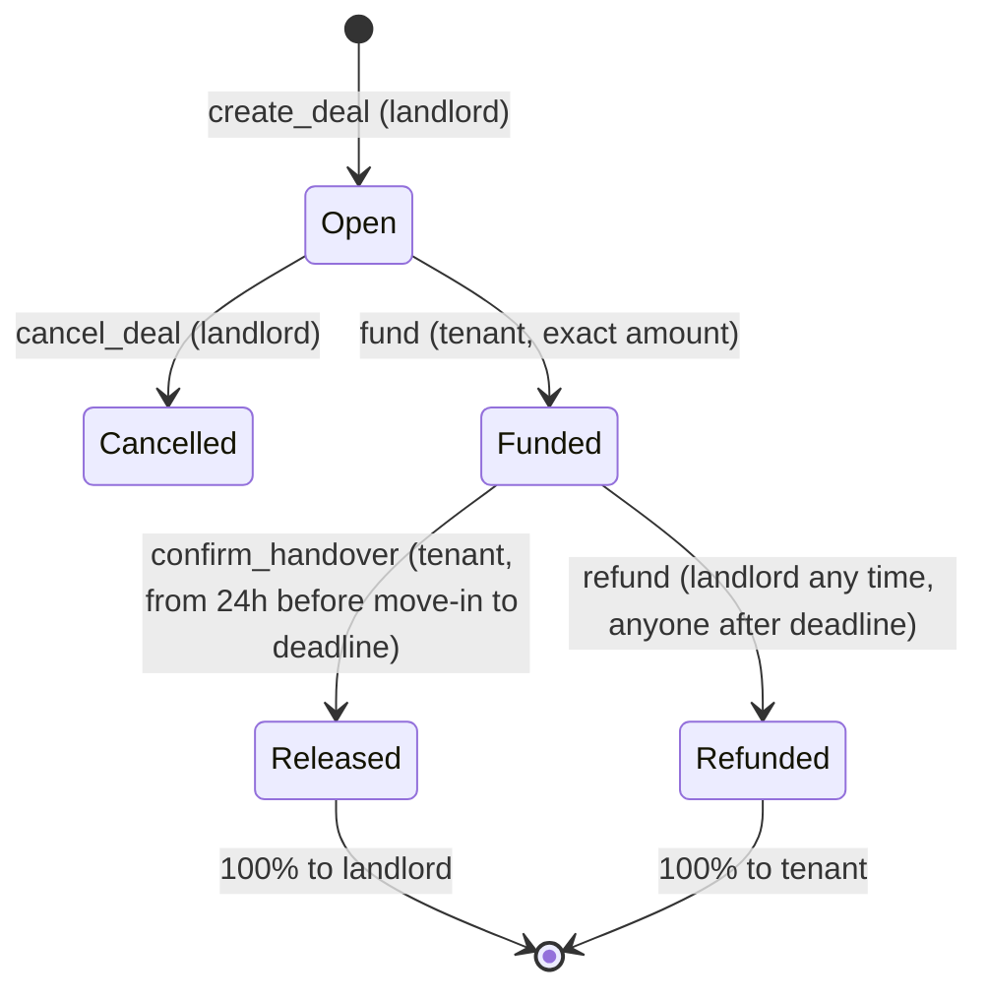

# Keysfirst Implementation Plan

> **For agentic workers:** REQUIRED SUB-SKILL: Use superpowers:subagent-driven-development (recommended) or superpowers:executing-plans to implement this plan task-by-task. Steps use checkbox (`- [ ]`) syntax for tracking.

**Goal:** Ship a devnet prototype where a rental deposit is locked on-chain and released to the landlord only when the tenant scans the landlord's Solana Pay QR at the key handover, otherwise refunded automatically, plus the repo, deck and video needed to win the Superteam Germany WHU challenge.

**Architecture:** One Anchor program (`programs/keysfirst`) with five instructions (`create_deal`, `fund`, `confirm_handover`, `refund`, `cancel_deal`) holding each deposit in a token account owned by a per-deal PDA; tested in Rust with LiteSVM (clock warping). One Next.js app (`web/`) on Vercel that reads deal accounts directly from devnet, builds instructions with the Anchor TS client, lets Phantom sign them, and serves the Solana Pay transaction-request endpoint and a devnet faucet. No database, no backend state, no admin key.

**Tech Stack:** Anchor 1.2.0 (anchor-lang, anchor-spl), Rust (toolchain pinned by `anchor init`), litesvm 0.10.0; Next.js 16 (App Router, TypeScript, Tailwind), `@anchor-lang/core` 1.2.x, `@solana/web3.js` 1.x, `@solana/spl-token` 0.4.x, `@solana/wallet-adapter-{base,react,react-ui}`, `qrcode.react` 4.x; dev-only: `vitest`, `@solana/spl-token-metadata`.

**Spec:** `docs/superpowers/specs/2026-09-27-keysfirst-design.md` (read it first; this plan implements it).

## Global Constraints

- Solana **devnet only**. Never mainnet, never real money.
- Never print, paste or commit private keys or seed phrases. Secrets live only in `~/.config/solana/id.json` (WSL), `.keys/` and `web/.env.local` (both gitignored), and Vercel environment variables.
- Anchor CLI / `anchor-lang` / `anchor-spl` **1.2.0**. The TypeScript client package is **`@anchor-lang/core`** (not `@coral-xyz/anchor`, renamed in Anchor 1.1.1).
- Anchor 1.x API facts used below: `CpiContext::new(program_id: Pubkey, accounts)` and `CpiContext::new_with_signer(program_id, accounts, seeds)` take the program **id**; duplicate mutable accounts are rejected only for serializing types (`Account`, `InterfaceAccount`); `anchor init` generates Rust LiteSVM tests run with `cargo test`.
- Program and tests run in **WSL Ubuntu** in `/mnt/c/Users/STAGE/Desktop/keysfirst`. From Windows, run them as: `wsl -d Ubuntu -e bash -lc 'cd /mnt/c/Users/STAGE/Desktop/keysfirst && <command>'`. Program test command: `anchor build && cargo test` (tests load `target/deploy/keysfirst.so`, so always build first).
- Web commands run in **Windows PowerShell** in `C:\Users\STAGE\Desktop\keysfirst\web`. Git runs from Windows.
- Program constants (keep web mirror in `web/src/lib/rules.ts` identical): handover opens `24 * 60 * 60` s before move-in; handover window max `14 * 24 * 60 * 60` s; max lock at funding `180 * 24 * 60 * 60` s; title max 64 bytes; PDA seed `b"deal"`.
- Token: Token-2022 mint "Test EUR (devnet)", symbol `tEUR`, 6 decimals. Program must also work with classic SPL Token (mainnet EURC).
- UI copy: plain English, no jargon (never "PDA", "escrow account", "lamports", "token account", "instruction"). Status labels exactly: `Waiting for deposit`, `Deposit locked`, `Released to landlord`, `Returned to tenant`, `Cancelled`. Amounts as `€600.00`.
- No runtime dependencies beyond the Tech Stack list without asking the user.
- Commits: small, on `main` (Vercel deploys from `main`), message format `type(scope): summary`, and every commit ends with the trailer: `git commit -m "<summary>" -m "Co-Authored-By: Claude Opus 5.5 <noreply@anthropic.com>"`.
- After each task, report: what works, what doesn't, what's next.

## File Structure

```
keysfirst/
├── .gitignore  .gitattributes  CLAUDE.md  README.md
├── Anchor.toml  Cargo.toml  Cargo.lock  rust-toolchain.toml      (from anchor init)
├── docs/
│   ├── superpowers/specs/2026-09-27-keysfirst-design.md
│   ├── superpowers/plans/2026-09-27-keysfirst.md                  (this file)
│   ├── spike.md          Solana Pay spike result
│   ├── deployments.md    program ID, mint, faucet address, deploy signature
│   ├── demo.md           demo wallets (public keys) + Explorer links + how to reproduce
│   └── interviews.md     student interview notes
├── programs/keysfirst/
│   ├── Cargo.toml
│   ├── src/
│   │   ├── lib.rs                 program entry, one fn per instruction
│   │   ├── constants.rs           seeds and time limits
│   │   ├── error.rs               KeysfirstError
│   │   ├── state.rs               Deal account + DealStatus
│   │   └── instructions/
│   │       ├── mod.rs
│   │       ├── create_deal.rs  fund.rs  confirm_handover.rs  refund.rs  cancel_deal.rs
│   │       └── payout.rs          shared "pay out vault, close vault" helper
│   └── tests/
│       ├── common/mod.rs          LiteSVM harness + instruction builders
│       ├── create_deal.rs  fund.rs  confirm_handover.rs  refund.rs  cancel_deal.rs
│       └── invariants.rs          conservation, exactly-once, donations, classic token
└── web/                           Next.js app (Vercel root directory)
    ├── .env.example  vitest.config.ts  package.json
    ├── public/icon.svg
    ├── scripts/sync-idl.mjs  scripts/create-test-eur.mjs
    └── src/
        ├── idl/keysfirst.json  idl/keysfirst.ts        (copied from target/ by sync-idl)
        ├── lib/  config.ts format.ts rules.ts program.ts instructions.ts send.ts hooks.ts origin.ts (+ *.test.ts)
        ├── components/  WalletButton OpenInPhantom Timeline ShareLink DealActions TestFundsButton HandoverQR (.tsx)
        └── app/
            ├── layout.tsx  providers.tsx  globals.css  page.tsx  opengraph-image.tsx
            ├── new/page.tsx
            ├── deal/[id]/page.tsx  deal/[id]/DealClient.tsx
            ├── test-eur.json/route.ts
            └── api/  handover/[id]/route.ts  faucet/route.ts
```

## Schedule (today is Sun 27 Sep 2026)

| Day | Tasks | Non-code (parallel) |
|---|---|---|
| Sun 27 | 0, 1 (spike — gate), start 2 (WSL needs reboot) | Follow @SuperteamDE; ask sponsor about deadline |
| Mon 28 | finish 2; 3, 4, 5 | Book 5 student interviews |
| Tue 29 | 6, 7, 8, 9 | Interviews |
| Wed 30 | 10, 11, 12 | Interviews; verify DAAD figures |
| Thu 1 Oct | 13, 14 | Deck outline |
| Fri 2 Oct | 15, 16 | Deck |
| Sat 3 Oct | 17 (video, submit) | — |
| Sun 4 Oct | Buffer only | — |

If behind: drop Task 14's OG image and metadata first, then the landing page polish. Never drop Task 1, 3–9, 12, 13, 15.

---

### Task 0: Repository foundation

**Files:**
- Create: `.gitignore`, `.gitattributes`, `CLAUDE.md`, `README.md`
- Already present: `docs/superpowers/specs/2026-09-27-keysfirst-design.md`, this plan

**Interfaces:**
- Produces: a git repo on `main` that ignores every secret location used later (`.keys/`, `.env*`, `target/`).

- [x] **Step 1: Initialise git**

Run (PowerShell, repo root): `git init -b main`
Expected: `Initialized empty Git repository in C:/Users/STAGE/Desktop/keysfirst/.git/`

- [x] **Step 2: Write `.gitignore`**

```gitignore
# Rust / Anchor
target/
test-ledger/
.anchor/
**/*-keypair.json

# Secrets (never commit)
.keys/
.env
.env.*
!.env.example

# Node / Next.js
node_modules/
.next/
out/
*.tsbuildinfo
next-env.d.ts
.vercel/

# OS / editors
.DS_Store
Thumbs.db
.vscode/
```

- [x] **Step 3: Write `.gitattributes`** (Rust and shell files must keep LF endings when edited from Windows)

```gitattributes
* text=auto eol=lf
*.png binary
*.jpg binary
*.so binary
```

- [x] **Step 4: Write `CLAUDE.md`**

```markdown
# Keysfirst — working notes for AI sessions

- Spec: docs/superpowers/specs/2026-09-27-keysfirst-design.md
- Plan: docs/superpowers/plans/2026-09-27-keysfirst.md (tick checkboxes as tasks complete)
- Devnet only. Never print, paste or commit private keys or seed phrases.
- Program/tests run in WSL: `wsl -d Ubuntu -e bash -lc 'cd /mnt/c/Users/STAGE/Desktop/keysfirst && anchor build && cargo test'`
- Web runs in PowerShell in `web/`: `npm run dev`, `npm test`, `npm run build`, `npm run lint`.
- Ask the user before adding dependencies or changing the deal rules in the spec (section 6).
- UI copy: plain English, no blockchain jargon; amounts in €.
- After each milestone: what works, what doesn't, what's next.
```

- [x] **Step 5: Write a stub `README.md`** (replaced in Task 16)

```markdown
# Keysfirst

Rental deposit escrow on Solana for students renting from abroad: the deposit moves only when the keys do.
Devnet prototype, work in progress. Design: [docs/superpowers/specs/2026-09-27-keysfirst-design.md](docs/superpowers/specs/2026-09-27-keysfirst-design.md).
```

- [x] **Step 6: Commit**

```bash
git add .gitignore .gitattributes CLAUDE.md README.md docs
git commit -m "chore: repository foundation, design spec and implementation plan" -m "Co-Authored-By: Claude Opus 5.5 <noreply@anthropic.com>"
```

- [x] **Step 7: Publish the repo (user, in browser)**

1. On github.com create a **public, empty** repository named `keysfirst` (no README, no license, no .gitignore).
2. Run the two commands GitHub shows under "push an existing repository", e.g.:
   `git remote add origin https://github.com/<your-account>/keysfirst.git` then `git push -u origin main`.
Expected: the spec and plan are visible on GitHub.

- [x] **Step 8: Admin (user)**

1. Follow https://x.com/SuperteamDE (submission requirement).
2. Message the sponsor on Telegram (@merdussss): "Hi! Building for the WHU Solana challenge. The listing shows October 8 as the deadline, the hackathon brief says October 4, 23:59. Which one counts? Thanks!" Record the answer in `CLAUDE.md` under a new line `- Deadline confirmed: ...`.

---

### Task 1: Web skeleton + Solana Pay spike on Vercel (GATE)

This proves the riskiest assumption before anything else: Phantom mobile on devnet can scan a Solana Pay **transaction request** QR, fetch a transaction from our server, sign it, and land it on devnet. It needs only Node (no Rust), so it runs while WSL installs.

**Files:**
- Create: `web/` (via create-next-app), `web/src/lib/config.ts`, `web/src/lib/origin.ts`, `web/public/icon.svg`, `web/src/app/api/spike/route.ts`, `web/src/app/spike/page.tsx`, `web/src/app/spike/SpikeQr.tsx`, `web/.env.example`, `docs/spike.md`
- Modify: `web/src/app/page.tsx` (replace generated content)

**Interfaces:**
- Produces: `RPC_URL: string` from `@/lib/config`; `getOrigin(): Promise<string>` from `@/lib/origin` (server-only); `/icon.svg`; a deployed Vercel URL (record it — later tasks call it `APP_URL`).

- [x] **Step 1: Generate the app** (PowerShell, repo root)

Run: `npx create-next-app@latest web --yes --ts --tailwind --eslint --app --src-dir --import-alias "@/*" --use-npm`
Expected: `Success! Created web at ...\keysfirst\web`. It must not create a nested git repo (it detects the parent repo); if `web\.git` exists, delete that folder.

- [x] **Step 2: Install spike dependencies**

Run (in `web/`): `npm install @solana/web3.js qrcode.react`
Expected: both appear in `web/package.json` dependencies. If npm reports a React peer-dependency conflict, re-run with `--legacy-peer-deps`.

In `web/tsconfig.json` change `"target": "ES2017"` to `"target": "ES2020"` (Task 10 uses BigInt literals such as `100n`, which need ES2020).

- [x] **Step 3: Write `web/src/lib/config.ts`** (extended in Task 10)

```ts
export const RPC_URL = process.env.NEXT_PUBLIC_RPC_URL || "https://api.devnet.solana.com";
```

- [x] **Step 4: Write `web/src/lib/origin.ts`**

```ts
import { headers } from "next/headers";

/** The public origin of the current request, e.g. https://keysfirst.vercel.app (server components only). */
export async function getOrigin(): Promise<string> {
  const h = await headers();
  const host = h.get("x-forwarded-host") ?? h.get("host") ?? "localhost:3000";
  const proto = h.get("x-forwarded-proto") ?? (host.startsWith("localhost") ? "http" : "https");
  return `${proto}://${host}`;
}
```

- [x] **Step 5: Write `web/public/icon.svg`** (Solana Pay wallets show this icon; must be absolute-URL reachable)

```svg
<svg xmlns="http://www.w3.org/2000/svg" viewBox="0 0 64 64"><rect width="64" height="64" rx="14" fill="#047857"/><circle cx="24" cy="32" r="10" fill="none" stroke="#fff" stroke-width="5"/><path d="M34 32h20M46 32v8M52 32v6" stroke="#fff" stroke-width="5" stroke-linecap="round"/></svg>
```

- [x] **Step 6: Write the spike endpoint `web/src/app/api/spike/route.ts`**

Solana Pay transaction request: the wallet sends `GET` (label + icon), then `POST {"account": "<wallet pubkey>"}` and expects `{"transaction": "<base64>", "message": "..."}`.

```ts
import { Connection, PublicKey, Transaction, TransactionInstruction } from "@solana/web3.js";
import { RPC_URL } from "@/lib/config";

const MEMO_PROGRAM_ID = new PublicKey("MemoSq4gqABAXKb96qnH8TysNcWxMyWCqXgDLGmfcHr");
const CORS = {
  "Access-Control-Allow-Origin": "*",
  "Access-Control-Allow-Methods": "GET,POST,OPTIONS",
  "Access-Control-Allow-Headers": "Content-Type",
};

export const dynamic = "force-dynamic";

export function OPTIONS() {
  return new Response(null, { status: 204, headers: CORS });
}

export function GET(req: Request) {
  const origin = new URL(req.url).origin;
  return Response.json({ label: "Keysfirst spike", icon: `${origin}/icon.svg` }, { headers: CORS });
}

export async function POST(req: Request) {
  let payer: PublicKey;
  try {
    payer = new PublicKey((await req.json()).account);
  } catch {
    return Response.json({ message: "Invalid account" }, { status: 400, headers: CORS });
  }
  const connection = new Connection(RPC_URL, "confirmed");
  const { blockhash, lastValidBlockHeight } = await connection.getLatestBlockhash("confirmed");
  const tx = new Transaction({ feePayer: payer, blockhash, lastValidBlockHeight }).add(
    new TransactionInstruction({
      programId: MEMO_PROGRAM_ID,
      keys: [{ pubkey: payer, isSigner: true, isWritable: false }],
      data: Buffer.from("Keysfirst spike: handover test", "utf8"),
    }),
  );
  const transaction = tx.serialize({ requireAllSignatures: false, verifySignatures: false }).toString("base64");
  return Response.json({ transaction, message: "Spike test: approve to write a memo on devnet" }, { headers: CORS });
}
```

- [x] **Step 7: Write the spike page**

`web/src/app/spike/SpikeQr.tsx`:

```tsx
"use client";

import { QRCodeSVG } from "qrcode.react";

export function SpikeQr({ value }: { value: string }) {
  return (
    <div className="mx-auto w-fit rounded-xl bg-white p-3">
      <QRCodeSVG value={value} size={280} marginSize={2} />
    </div>
  );
}
```

`web/src/app/spike/page.tsx`:

```tsx
import { getOrigin } from "@/lib/origin";
import { SpikeQr } from "./SpikeQr";

export default async function SpikePage() {
  const url = `solana:${await getOrigin()}/api/spike`;
  return (
    <main className="mx-auto max-w-md space-y-4 p-6 text-center">
      <h1 className="text-2xl font-semibold">Solana Pay spike</h1>
      <p className="text-sm">Phantom mobile → Testnet Mode on (Solana Devnet) → scan this code.</p>
      <SpikeQr value={url} />
      <p className="break-all font-mono text-xs text-stone-500">{url}</p>
    </main>
  );
}
```

- [x] **Step 8: Replace `web/src/app/page.tsx`** (temporary; real landing page in Task 14)

```tsx
export default function Home() {
  return (
    <main className="mx-auto max-w-md p-6">
      <h1 className="text-2xl font-semibold">Keysfirst</h1>
      <p className="mt-2">The deposit moves only when the keys do. Devnet prototype, coming soon.</p>
    </main>
  );
}
```

- [x] **Step 9: Write `web/.env.example`** (extended in Task 9)

```bash
# Devnet RPC endpoint. A free dedicated devnet key (e.g. Helius) avoids public rate limits during the demo.
NEXT_PUBLIC_RPC_URL=https://api.devnet.solana.com
```

- [x] **Step 10: Verify locally**

Run (in `web/`): `npm run lint` then `npm run build`
Expected: both succeed.

Run: `npm run dev` (leave running), then in a second PowerShell:
`Invoke-RestMethod http://localhost:3000/api/spike`
Expected: `label` = `Keysfirst spike`, `icon` = `http://localhost:3000/icon.svg`.

`Invoke-RestMethod -Method Post -ContentType "application/json" -Body '{"account":"11111111111111111111111111111112"}' http://localhost:3000/api/spike`
Expected: an object whose `transaction` is a long base64 string. Stop the dev server.

- [x] **Step 11: Commit and push**

```bash
git add web
git commit -m "feat(web): Next.js skeleton and Solana Pay transaction-request spike" -m "Co-Authored-By: Claude Opus 5.5 <noreply@anthropic.com>"
git push
```

- [x] **Step 12: Deploy to Vercel (user, in browser)**

1. vercel.com → Add New → Project → import the `keysfirst` GitHub repo.
2. **Root Directory: `web`** and **Framework Preset: Next.js** (if left at `./`, Vercel builds the repo root and every page returns 404). In Settings → Deployment Protection choose Standard Protection or turn Vercel Authentication off, otherwise Phantom mobile cannot reach the site. Deploy.
3. Record the production URL (e.g. `https://keysfirst-xyz.vercel.app`); this is `APP_URL` from now on.
4. Check `APP_URL/api/spike` in a browser returns the label JSON.

- [x] **Step 13: Phone test (user)**

1. Phantom mobile: profile icon → Settings → Developer Settings → **Testnet Mode ON**, Solana network **Devnet**.
2. Copy the phone wallet's address, get devnet SOL at https://faucet.solana.com (paste the address, pick Devnet).
3. On the laptop open `APP_URL/spike`. In Phantom mobile tap the scan (QR) icon and scan the code.
4. Expected: Phantom shows "Keysfirst spike", the message, and an approve screen. Approve.
5. Find the transaction: Phantom → Activity, or https://explorer.solana.com/address/<phone-wallet>?cluster=devnet. It must contain the memo "Keysfirst spike: handover test".

- [x] **Step 14: Record the result**

Write `docs/spike.md`:

```markdown
# Solana Pay spike (Task 1)

- Date: <today>
- Phantom version / phone OS: <fill in>
- Result: PASS | FAIL
- Devnet transaction: https://explorer.solana.com/tx/<signature>?cluster=devnet
- Notes: <any warnings Phantom showed, e.g. simulation or unknown-app warnings>
```

Commit: `git add docs/spike.md` then `git commit -m "docs: record Solana Pay spike result" -m "Co-Authored-By: Claude Opus 5.5 <noreply@anthropic.com>"`.

- [x] **Step 15: If it failed — troubleshoot, then escalate** (not needed: PASS on 2026-09-27, see docs/spike.md)

Check in order: (a) Testnet Mode is on and set to Devnet (a mainnet wallet rejects a devnet blockhash); (b) the phone wallet has devnet SOL; (c) `APP_URL/api/spike` answers over HTTPS from the phone's browser; (d) the QR text starts with `solana:https://` and contains no query string; (e) retry after 1 minute (blockhash expiry). If it still fails, **stop and tell the user immediately**: the fallback is the in-app "I have the keys" button (Task 12), same on-chain instruction, and Task 13 then ships the QR as best-effort.

---
### Task 2: Solana toolchain in WSL + Anchor workspace

**Files:**
- Create: `Anchor.toml`, `Cargo.toml`, `rust-toolchain.toml`, `Cargo.lock`, `programs/keysfirst/**` (copied from a scaffold generated by `anchor init`)
- Create (gitignored): `target/deploy/keysfirst-keypair.json`, `.keys/keysfirst-program-keypair.json`

**Interfaces:**
- Produces: a building Anchor 1.2.0 workspace whose program id (`declare_id!`) matches `target/deploy/keysfirst-keypair.json`; a funded devnet deploy wallet at `~/.config/solana/id.json` (WSL).

- [x] **Step 1: Install WSL (user, admin PowerShell)**

Run: `wsl --install -d Ubuntu`, reboot when asked, then open "Ubuntu" from the Start menu and create a Linux user name and password.
Expected: an Ubuntu shell prompt.

- [x] **Step 2: Install Rust, Solana CLI and Anchor (Ubuntu shell)**

Run: `curl --proto '=https' --tlsv1.2 -sSfL https://solana-install.solana.workers.dev | bash`
Expected: the summary prints versions for Rust, Solana CLI, Anchor CLI (plus Surfpool, Node.js, Yarn).

- [x] **Step 3: Make the tools visible to non-interactive shells**

`~/.bashrc` returns early for non-interactive shells, so commands launched from Windows (`wsl ... bash -lc`) need PATH in `~/.profile`:

```bash
echo 'export PATH="$HOME/.local/share/solana/install/active_release/bin:$HOME/.avm/bin:$HOME/.cargo/bin:$PATH"' >> ~/.profile
```

Verify from **Windows PowerShell**:
`wsl -d Ubuntu -e bash -lc 'anchor --version && solana --version && cargo --version'`
Expected: `anchor-cli 1.2.0`, a `solana-cli` line, a `cargo` line. If Anchor is not 1.2.0: `avm install 1.2.0 && avm use 1.2.0`.

- [x] **Step 4: Create the devnet deploy wallet (Ubuntu shell)**

```bash
solana-keygen new --no-bip39-passphrase --silent -o ~/.config/solana/id.json
solana config set --url devnet
solana address
solana airdrop 2
```

Expected: an address is printed (public, safe to share). If the airdrop is rate-limited, paste the address into https://faucet.solana.com (Devnet). Keep topping up until `solana balance` shows **≥ 5 SOL** before Task 9.

- [x] **Step 5: Generate a scaffold and copy it into the repo (Ubuntu shell)**

```bash
cd ~ && anchor init keysfirst --no-git --no-install
REPO=/mnt/c/Users/STAGE/Desktop/keysfirst
cp ~/keysfirst/Anchor.toml ~/keysfirst/Cargo.toml ~/keysfirst/rust-toolchain.toml "$REPO"/
mkdir -p "$REPO/programs" "$REPO/target/deploy" "$REPO/.keys"
cp -r ~/keysfirst/programs/keysfirst "$REPO/programs/"
cp ~/keysfirst/target/deploy/keysfirst-keypair.json "$REPO/target/deploy/" 2>/dev/null || echo "no scaffold keypair; anchor build will create one"
```

Expected: `programs/keysfirst/src/lib.rs` and `programs/keysfirst/tests/test_initialize.rs` exist in the repo.

- [x] **Step 6: Build and align the program id**

Run (Ubuntu shell, in `$REPO`): `anchor build`
If it stops with a program-id mismatch: `anchor keys sync` then `anchor build` again.
Expected: `target/deploy/keysfirst.so` and `target/idl/keysfirst.json` exist. First build takes several minutes (the repo is on the Windows drive; that is expected).

- [x] **Step 7: Back up the program keypair and register devnet**

```bash
cp target/deploy/keysfirst-keypair.json .keys/keysfirst-program-keypair.json
anchor keys list
```

Open `Anchor.toml`. Under the existing `[programs.localnet]` block add a `[programs.devnet]` block with the **same** id that `anchor keys list` printed:

```toml
[programs.devnet]
keysfirst = "<the id printed by anchor keys list>"
```

- [ ] **Step 8: Run the scaffold test**

Run: `cargo test`
Expected: `test test_initialize ... ok`, `test result: ok. 1 passed`.

- [ ] **Step 9: Commit** (PowerShell)

```bash
git add Anchor.toml Cargo.toml Cargo.lock rust-toolchain.toml programs
git commit -m "chore(program): Anchor 1.2 workspace with LiteSVM test template" -m "Co-Authored-By: Claude Opus 5.5 <noreply@anthropic.com>"
```

Verify `git status` shows no `target/` or `.keys/` files staged.

---
### Task 3: Program core + `create_deal` + test harness

**Files:**
- Delete: everything under `programs/keysfirst/src/` and `programs/keysfirst/tests/` from the scaffold (after saving the program id)
- Modify: `programs/keysfirst/Cargo.toml`
- Create: `programs/keysfirst/src/{lib.rs,constants.rs,error.rs,state.rs}`, `programs/keysfirst/src/instructions/{mod.rs,create_deal.rs}`
- Test: `programs/keysfirst/tests/common/mod.rs`, `programs/keysfirst/tests/create_deal.rs`

**Interfaces:**
- Produces (Rust, used by every later task):
  - `keysfirst::constants::{DEAL_SEED, MAX_TITLE_LEN, HANDOVER_OPENS_BEFORE_MOVE_IN, MAX_HANDOVER_WINDOW, MAX_LOCK_DURATION}`
  - `keysfirst::state::{Deal, DealStatus}`; `Deal` fields: `landlord, tenant, mint: Pubkey; deal_id, amount: u64; move_in, deadline, created_at, funded_at, settled_at: i64; status: DealStatus; bump: u8; title: String`
  - `DealStatus::{Open, Funded, Released, Refunded, Cancelled}`
  - `keysfirst::error::KeysfirstError` (all variants, listed in Step 7)
  - Instruction `create_deal(deal_id: u64, amount: u64, move_in: i64, deadline: i64, title: String)`; accounts `landlord, deal, mint, vault, landlord_token, token_program, associated_token_program, system_program`
  - Test helpers in `tests/common/mod.rs`: `setup()`, `setup_with(token_program)`, `Env { svm, landlord, tenant, stranger, mint_authority, mint, token_program }`, `Env::key(Who)`, `Env::run(ix, Who)`, `Env::run_many(&[ix], Who)`, `Who::{Landlord, Tenant, Stranger}`, `DealParams`, `set_time`, `send`, `assert_ok`, `assert_err`, `create_mint`, `mint_tokens`, `mint_to`, `ata`, `ata_for`, `balance`, `exists`, `lamports`, `deal_pda`, `get_deal`, `ix_create_deal`, `create_deal`; constants `T0, DAY, DECIMALS, EUR, AMOUNT, START_BALANCE`.
- PDA: deal = `[b"deal", landlord, deal_id.to_le_bytes()]`; vault = associated token account of (deal, mint, token program).

- [ ] **Step 1: Save the program id, then clear the scaffold code**

Run (Ubuntu shell, repo root): `grep declare_id programs/keysfirst/src/lib.rs`
Write down the id inside `declare_id!("...")`. Then:

```bash
rm -rf programs/keysfirst/src/* programs/keysfirst/tests/*
mkdir -p programs/keysfirst/src/instructions programs/keysfirst/tests/common
```

- [ ] **Step 2: Add dependencies in `programs/keysfirst/Cargo.toml`**

Keep everything `anchor init` generated (including the `[dev-dependencies]` versions) and change only these lines:

```toml
[features]
# ...keep the other generated feature lines...
idl-build = ["anchor-lang/idl-build", "anchor-spl/idl-build"]

[dependencies]
anchor-lang = { version = "1.2.0", features = ["init-if-needed"] }
anchor-spl = "1.2.0"
```

Also set the package `description` to `"Rental deposit escrow: the money moves only when the keys do"`.

- [ ] **Step 3: Write the test harness `programs/keysfirst/tests/common/mod.rs`**

```rust
//! Shared test helpers: a fresh LiteSVM chain with the Keysfirst program,
//! a 6-decimal test token, and funded wallets for landlord, tenant and a stranger.
#![allow(dead_code)]

pub use {
    anchor_lang::{prelude::Pubkey, solana_program::instruction::Instruction},
    anchor_spl::token_2022::spl_token_2022,
    litesvm::types::TransactionResult,
    solana_keypair::Keypair,
    solana_signer::Signer,
};
use {
    anchor_lang::{
        prelude::Clock,
        solana_program::{system_instruction, system_program},
        AccountDeserialize, InstructionData, ToAccountMetas,
    },
    anchor_spl::{
        associated_token::{self, get_associated_token_address_with_program_id, spl_associated_token_account},
        token_interface::TokenAccount,
    },
    keysfirst::{constants::DEAL_SEED, state::Deal},
    litesvm::LiteSVM,
    solana_message::{Message, VersionedMessage},
    solana_transaction::versioned::VersionedTransaction,
};

pub const T0: i64 = 1_800_000_000; // "now" at the start of every test (Jan 2027)
pub const DAY: i64 = 86_400;
pub const DECIMALS: u8 = 6;
pub const EUR: u64 = 1_000_000; // 1 test EUR in base units
pub const AMOUNT: u64 = 600 * EUR;
pub const START_BALANCE: u64 = 1_000 * EUR;
const MINT_LEN: usize = 82; // mint without extensions; same size for Token and Token-2022

#[derive(Clone, Copy, Debug)]
pub enum Who {
    Landlord,
    Tenant,
    Stranger,
}

pub struct Env {
    pub svm: LiteSVM,
    pub landlord: Keypair,
    pub tenant: Keypair,
    pub stranger: Keypair,
    pub mint_authority: Keypair,
    pub mint: Pubkey,
    pub token_program: Pubkey,
}

impl Env {
    pub fn key(&self, who: Who) -> &Keypair {
        match who {
            Who::Landlord => &self.landlord,
            Who::Tenant => &self.tenant,
            Who::Stranger => &self.stranger,
        }
    }

    /// Sends one instruction signed and paid for by `who`.
    pub fn run(&mut self, ix: Instruction, who: Who) -> TransactionResult {
        self.run_many(&[ix], who)
    }

    pub fn run_many(&mut self, ixs: &[Instruction], who: Who) -> TransactionResult {
        let Env { svm, landlord, tenant, stranger, .. } = self;
        let signer: &Keypair = match who {
            Who::Landlord => landlord,
            Who::Tenant => tenant,
            Who::Stranger => stranger,
        };
        send(svm, ixs, signer, &[signer])
    }
}

pub struct DealParams {
    pub deal_id: u64,
    pub amount: u64,
    pub move_in: i64,
    pub deadline: i64,
    pub title: String,
}

impl Default for DealParams {
    fn default() -> Self {
        Self {
            deal_id: 1,
            amount: AMOUNT,
            move_in: T0 + 10 * DAY,
            deadline: T0 + 13 * DAY,
            title: "Room in Vallendar".to_string(),
        }
    }
}

/// Token-2022 test token (like the devnet Test EUR).
pub fn setup() -> Env {
    setup_with(anchor_spl::token_2022::ID)
}

pub fn setup_with(token_program: Pubkey) -> Env {
    let mut svm = LiteSVM::new();
    let program = include_bytes!(concat!(env!("CARGO_TARGET_TMPDIR"), "/../deploy/keysfirst.so"));
    svm.add_program(keysfirst::id(), program).unwrap();
    set_time(&mut svm, T0);

    let mut env = Env {
        svm,
        landlord: Keypair::new(),
        tenant: Keypair::new(),
        stranger: Keypair::new(),
        mint_authority: Keypair::new(),
        mint: Pubkey::default(),
        token_program,
    };
    let wallets = [
        env.landlord.pubkey(),
        env.tenant.pubkey(),
        env.stranger.pubkey(),
        env.mint_authority.pubkey(),
    ];
    for wallet in wallets {
        env.svm.airdrop(&wallet, 10_000_000_000).unwrap();
    }
    env.mint = create_mint(&mut env);
    let (tenant, stranger) = (env.tenant.pubkey(), env.stranger.pubkey());
    mint_to(&mut env, &tenant, START_BALANCE);
    mint_to(&mut env, &stranger, START_BALANCE);
    env
}

pub fn set_time(svm: &mut LiteSVM, unix_timestamp: i64) {
    let mut clock: Clock = svm.get_sysvar();
    clock.unix_timestamp = unix_timestamp;
    svm.set_sysvar(&clock);
}

pub fn send(svm: &mut LiteSVM, ixs: &[Instruction], payer: &Keypair, signers: &[&Keypair]) -> TransactionResult {
    let msg = Message::new_with_blockhash(ixs, Some(&payer.pubkey()), &svm.latest_blockhash());
    let tx = VersionedTransaction::try_new(VersionedMessage::Legacy(msg), signers).unwrap();
    let result = svm.send_transaction(tx);
    svm.expire_blockhash(); // lets an identical transaction through next time
    result
}

pub fn assert_ok(result: &TransactionResult) {
    if let Err(failed) = result {
        panic!("transaction failed: {:?}\n{}", failed.err, failed.meta.logs.join("\n"));
    }
}

/// Asserts the transaction failed with the given Anchor error name, e.g. "NotTenant".
pub fn assert_err(result: &TransactionResult, code: &str) {
    match result {
        Ok(_) => panic!("expected error {code}, but the transaction succeeded"),
        Err(failed) => assert!(
            failed.meta.logs.iter().any(|line| line.contains(&format!("Error Code: {code}"))),
            "expected error {code}, got {:?}\n{}",
            failed.err,
            failed.meta.logs.join("\n")
        ),
    }
}

pub fn create_mint(env: &mut Env) -> Pubkey {
    let mint = Keypair::new();
    let authority = env.mint_authority.pubkey();
    let rent = env.svm.minimum_balance_for_rent_exemption(MINT_LEN);
    let ixs = [
        system_instruction::create_account(&authority, &mint.pubkey(), rent, MINT_LEN as u64, &env.token_program),
        spl_token_2022::instruction::initialize_mint2(&env.token_program, &mint.pubkey(), &authority, None, DECIMALS)
            .unwrap(),
    ];
    let Env { svm, mint_authority, .. } = env;
    assert_ok(&send(svm, &ixs, mint_authority, &[&*mint_authority, &mint]));
    mint.pubkey()
}

/// Mints `amount` of `mint` to `owner`'s associated token account (created if missing).
pub fn mint_tokens(env: &mut Env, mint: Pubkey, owner: &Pubkey, amount: u64) -> Pubkey {
    let authority = env.mint_authority.pubkey();
    let account = get_associated_token_address_with_program_id(owner, &mint, &env.token_program);
    let ixs = [
        spl_associated_token_account::instruction::create_associated_token_account_idempotent(
            &authority,
            owner,
            &mint,
            &env.token_program,
        ),
        spl_token_2022::instruction::mint_to_checked(&env.token_program, &mint, &account, &authority, &[], amount, DECIMALS)
            .unwrap(),
    ];
    let Env { svm, mint_authority, .. } = env;
    assert_ok(&send(svm, &ixs, mint_authority, &[&*mint_authority]));
    account
}

pub fn mint_to(env: &mut Env, owner: &Pubkey, amount: u64) -> Pubkey {
    let mint = env.mint;
    mint_tokens(env, mint, owner, amount)
}

/// Associated token account of `owner` for the test token.
pub fn ata(env: &Env, owner: &Pubkey) -> Pubkey {
    ata_for(env, owner, &env.mint)
}

pub fn ata_for(env: &Env, owner: &Pubkey, mint: &Pubkey) -> Pubkey {
    get_associated_token_address_with_program_id(owner, mint, &env.token_program)
}

/// Token balance; 0 if the account does not exist (e.g. a closed vault).
pub fn balance(env: &Env, token_account: Pubkey) -> u64 {
    match env.svm.get_account(&token_account) {
        Some(account) if account.lamports > 0 => {
            TokenAccount::try_deserialize(&mut account.data.as_slice()).unwrap().amount
        }
        _ => 0,
    }
}

pub fn exists(env: &Env, address: Pubkey) -> bool {
    env.svm.get_account(&address).is_some_and(|account| account.lamports > 0)
}

pub fn lamports(env: &Env, address: Pubkey) -> u64 {
    env.svm.get_account(&address).map_or(0, |account| account.lamports)
}

pub fn deal_pda(landlord: &Pubkey, deal_id: u64) -> Pubkey {
    Pubkey::find_program_address(&[DEAL_SEED, landlord.as_ref(), &deal_id.to_le_bytes()], &keysfirst::id()).0
}

pub fn get_deal(env: &Env, deal: Pubkey) -> Deal {
    let account = env.svm.get_account(&deal).expect("deal account missing");
    Deal::try_deserialize(&mut account.data.as_slice()).unwrap()
}

pub fn ix_create_deal(env: &Env, p: &DealParams) -> Instruction {
    let landlord = env.landlord.pubkey();
    let deal = deal_pda(&landlord, p.deal_id);
    Instruction::new_with_bytes(
        keysfirst::id(),
        &keysfirst::instruction::CreateDeal {
            deal_id: p.deal_id,
            amount: p.amount,
            move_in: p.move_in,
            deadline: p.deadline,
            title: p.title.clone(),
        }
        .data(),
        keysfirst::accounts::CreateDeal {
            landlord,
            deal,
            mint: env.mint,
            vault: ata(env, &deal),
            landlord_token: ata(env, &landlord),
            token_program: env.token_program,
            associated_token_program: associated_token::ID,
            system_program: system_program::ID,
        }
        .to_account_metas(None),
    )
}

/// Creates the deal as the landlord and returns its address.
pub fn create_deal(env: &mut Env, p: &DealParams) -> Pubkey {
    let ix = ix_create_deal(env, p);
    assert_ok(&env.run(ix, Who::Landlord));
    deal_pda(&env.landlord.pubkey(), p.deal_id)
}
```

If the compiler reports that `Clock` does not implement the sysvar traits LiteSVM expects (a crate-version split), add `solana-clock = "3"` to `[dev-dependencies]` and replace `prelude::Clock` with `solana_clock::Clock` in the `use` block.

- [ ] **Step 4: Write the failing tests `programs/keysfirst/tests/create_deal.rs`**

```rust
mod common;

use common::*;
use keysfirst::state::DealStatus;

fn try_create(env: &mut Env, p: DealParams) -> TransactionResult {
    let ix = ix_create_deal(env, &p);
    env.run(ix, Who::Landlord)
}

#[test]
fn creates_an_open_deal_with_an_empty_vault() {
    let mut env = setup();
    let p = DealParams::default();
    let deal = create_deal(&mut env, &p);

    let d = get_deal(&env, deal);
    assert_eq!(d.landlord, env.landlord.pubkey());
    assert_eq!(d.tenant, Pubkey::default());
    assert_eq!(d.mint, env.mint);
    assert_eq!(d.deal_id, 1);
    assert_eq!(d.amount, AMOUNT);
    assert_eq!(d.move_in, p.move_in);
    assert_eq!(d.deadline, p.deadline);
    assert_eq!(d.created_at, T0);
    assert_eq!(d.status, DealStatus::Open);
    assert_eq!(d.title, "Room in Vallendar");
    assert!(exists(&env, ata(&env, &deal)), "vault must exist");
    assert_eq!(balance(&env, ata(&env, &deal)), 0);
    assert!(exists(&env, ata(&env, &env.landlord.pubkey())), "landlord token account is prepared");
}

#[test]
fn rejects_a_zero_amount() {
    let mut env = setup();
    let res = try_create(&mut env, DealParams { amount: 0, ..Default::default() });
    assert_err(&res, "InvalidAmount");
}

#[test]
fn accepts_a_title_of_exactly_64_bytes() {
    let mut env = setup();
    assert_ok(&try_create(&mut env, DealParams { title: "x".repeat(64), ..Default::default() }));
}

#[test]
fn rejects_a_title_longer_than_64_bytes() {
    let mut env = setup();
    let res = try_create(&mut env, DealParams { title: "x".repeat(65), ..Default::default() });
    assert_err(&res, "TitleTooLong");
}

#[test]
fn rejects_a_deadline_that_is_not_after_move_in() {
    let mut env = setup();
    let res = try_create(&mut env, DealParams { deadline: T0 + 10 * DAY, ..Default::default() });
    assert_err(&res, "InvalidSchedule");
}

#[test]
fn rejects_a_handover_window_longer_than_14_days() {
    let mut env = setup();
    let move_in = T0 + 10 * DAY;
    let res = try_create(&mut env, DealParams { move_in, deadline: move_in + 14 * DAY + 1, ..Default::default() });
    assert_err(&res, "InvalidSchedule");
}

#[test]
fn rejects_a_deadline_in_the_past() {
    let mut env = setup();
    let res = try_create(&mut env, DealParams { move_in: T0 - 3 * DAY, deadline: T0 - DAY, ..Default::default() });
    assert_err(&res, "DeadlinePassed");
}
```

- [ ] **Step 5: Run the tests to see them fail**

Run (Ubuntu shell): `cargo test --test create_deal`
Expected: compile errors such as `unresolved import keysfirst::constants` (the program has no code yet).

- [ ] **Step 6: Write `programs/keysfirst/src/constants.rs`**

```rust
/// Seed for each deal account: [DEAL_SEED, landlord, deal_id (little-endian u64)].
pub const DEAL_SEED: &[u8] = b"deal";

/// Room description limit, in bytes.
pub const MAX_TITLE_LEN: usize = 64;

/// The tenant can confirm the handover from 24 hours before move-in.
/// Stops "scan this QR to confirm your booking" tricks weeks in advance.
pub const HANDOVER_OPENS_BEFORE_MOVE_IN: i64 = 24 * 60 * 60;

/// The handover deadline is at most 14 days after move-in.
pub const MAX_HANDOVER_WINDOW: i64 = 14 * 24 * 60 * 60;

/// Funding may lock the tenant's money for at most 180 days.
pub const MAX_LOCK_DURATION: i64 = 180 * 24 * 60 * 60;
```

- [ ] **Step 7: Write `programs/keysfirst/src/error.rs`**

```rust
use anchor_lang::prelude::*;

#[error_code]
pub enum KeysfirstError {
    #[msg("The deposit must be more than zero")]
    InvalidAmount,
    #[msg("The room description is too long (max 64 bytes)")]
    TitleTooLong,
    #[msg("The handover deadline must be after move-in and at most 14 days later")]
    InvalidSchedule,
    #[msg("The handover deadline has passed")]
    DeadlinePassed,
    #[msg("Paying now would lock the deposit for more than 180 days")]
    LockTooLong,
    #[msg("This deal is not waiting for a deposit")]
    DealNotOpen,
    #[msg("This deal has no locked deposit")]
    DealNotFunded,
    #[msg("The landlord cannot pay their own deposit")]
    LandlordCannotFund,
    #[msg("Only the tenant who paid can confirm the handover")]
    NotTenant,
    #[msg("Only the landlord can do this")]
    NotLandlord,
    #[msg("The handover opens 24 hours before move-in")]
    HandoverNotOpenYet,
    #[msg("Only the landlord can return the deposit before the deadline")]
    DeadlineNotReached,
    #[msg("This token does not match the deal")]
    WrongMint,
    #[msg("This account is not the deal's tenant")]
    WrongTenant,
    #[msg("This account is not the deal's landlord")]
    WrongLandlord,
}
```

- [ ] **Step 8: Write `programs/keysfirst/src/state.rs`**

```rust
use anchor_lang::prelude::*;

#[derive(AnchorSerialize, AnchorDeserialize, Clone, Copy, PartialEq, Eq, Debug, InitSpace)]
pub enum DealStatus {
    /// Created, waiting for the tenant's deposit.
    Open,
    /// Deposit locked in the vault.
    Funded,
    /// Tenant confirmed the handover; deposit paid to the landlord.
    Released,
    /// Deposit returned to the tenant.
    Refunded,
    /// Landlord withdrew the deal before anyone paid.
    Cancelled,
}

/// One rental deposit. Stays on-chain after settlement as a public receipt.
#[account]
#[derive(InitSpace)]
pub struct Deal {
    pub landlord: Pubkey,
    /// Pubkey::default() until someone funds the deal.
    pub tenant: Pubkey,
    pub mint: Pubkey,
    pub deal_id: u64,
    /// Exact deposit in the token's base units.
    pub amount: u64,
    /// Unix seconds.
    pub move_in: i64,
    /// Unix seconds. After this, anyone can return the deposit to the tenant.
    pub deadline: i64,
    pub created_at: i64,
    pub funded_at: i64,
    pub settled_at: i64,
    pub status: DealStatus,
    pub bump: u8,
    #[max_len(64)]
    pub title: String,
}
```

- [ ] **Step 9: Write `programs/keysfirst/src/instructions/create_deal.rs`**

```rust
use anchor_lang::prelude::*;
use anchor_spl::{
    associated_token::AssociatedToken,
    token_interface::{Mint, TokenAccount, TokenInterface},
};

use crate::{constants::*, error::KeysfirstError, state::*};

#[derive(Accounts)]
#[instruction(deal_id: u64)]
pub struct CreateDeal<'info> {
    #[account(mut)]
    pub landlord: Signer<'info>,

    #[account(
        init,
        payer = landlord,
        space = 8 + Deal::INIT_SPACE, // 8-byte account discriminator
        seeds = [DEAL_SEED, landlord.key().as_ref(), &deal_id.to_le_bytes()],
        bump,
    )]
    pub deal: Account<'info, Deal>,

    #[account(mint::token_program = token_program)]
    pub mint: Box<InterfaceAccount<'info, Mint>>,

    /// Holds the deposit. Owned by the deal account, so only the program's rules can move it.
    #[account(
        init,
        payer = landlord,
        associated_token::mint = mint,
        associated_token::authority = deal,
        associated_token::token_program = token_program,
    )]
    pub vault: Box<InterfaceAccount<'info, TokenAccount>>,

    /// Prepared now so the tenant never pays for it at the handover.
    #[account(
        init_if_needed,
        payer = landlord,
        associated_token::mint = mint,
        associated_token::authority = landlord,
        associated_token::token_program = token_program,
    )]
    pub landlord_token: Box<InterfaceAccount<'info, TokenAccount>>,

    pub token_program: Interface<'info, TokenInterface>,
    pub associated_token_program: Program<'info, AssociatedToken>,
    pub system_program: Program<'info, System>,
}

pub fn handle_create_deal(
    ctx: Context<CreateDeal>,
    deal_id: u64,
    amount: u64,
    move_in: i64,
    deadline: i64,
    title: String,
) -> Result<()> {
    let now = Clock::get()?.unix_timestamp;
    require!(amount > 0, KeysfirstError::InvalidAmount);
    require!(title.len() <= MAX_TITLE_LEN, KeysfirstError::TitleTooLong);
    let window = deadline.checked_sub(move_in).ok_or(KeysfirstError::InvalidSchedule)?;
    require!(window > 0 && window <= MAX_HANDOVER_WINDOW, KeysfirstError::InvalidSchedule);
    require!(deadline > now, KeysfirstError::DeadlinePassed);

    ctx.accounts.deal.set_inner(Deal {
        landlord: ctx.accounts.landlord.key(),
        tenant: Pubkey::default(),
        mint: ctx.accounts.mint.key(),
        deal_id,
        amount,
        move_in,
        deadline,
        created_at: now,
        funded_at: 0,
        settled_at: 0,
        status: DealStatus::Open,
        bump: ctx.bumps.deal,
        title,
    });
    Ok(())
}
```

- [ ] **Step 10: Write `programs/keysfirst/src/instructions/mod.rs`**

```rust
pub mod create_deal;

pub use create_deal::*;
```

- [ ] **Step 11: Write `programs/keysfirst/src/lib.rs`** (use the id saved in Step 1)

```rust
use anchor_lang::prelude::*;

pub mod constants;
pub mod error;
pub mod instructions;
pub mod state;

pub use constants::*;
pub use instructions::*;
pub use state::*;

declare_id!("<the program id saved in Step 1>");

/// Keysfirst: a rental deposit that moves only when the keys do.
#[program]
pub mod keysfirst {
    use super::*;

    /// Landlord opens a deal. Creates the deal record and its empty vault.
    pub fn create_deal(
        ctx: Context<CreateDeal>,
        deal_id: u64,
        amount: u64,
        move_in: i64,
        deadline: i64,
        title: String,
    ) -> Result<()> {
        instructions::create_deal::handle_create_deal(ctx, deal_id, amount, move_in, deadline, title)
    }
}
```

- [ ] **Step 12: Build and run the tests**

Run: `anchor build && cargo test --test create_deal`
Expected: `test result: ok. 7 passed`. If `anchor build` reports a program-id mismatch, run `anchor keys sync` and rebuild.

- [ ] **Step 13: Commit** (PowerShell)

```bash
git add programs Cargo.lock
git commit -m "feat(program): deal account and create_deal with LiteSVM test harness" -m "Co-Authored-By: Claude Opus 5.5 <noreply@anthropic.com>"
```

---

### Task 4: `fund`

**Files:**
- Create: `programs/keysfirst/src/instructions/fund.rs`
- Modify: `programs/keysfirst/src/instructions/mod.rs`, `programs/keysfirst/src/lib.rs`
- Test: append to `programs/keysfirst/tests/common/mod.rs`; create `programs/keysfirst/tests/fund.rs`

**Interfaces:**
- Consumes: `Deal`, `DealStatus`, `KeysfirstError`, `DEAL_SEED`, `MAX_LOCK_DURATION` (Task 3).
- Produces: instruction `fund()` (no arguments; amount comes from the deal); accounts `tenant (signer), deal, mint, tenant_token, vault, token_program`. Test helpers `ix_fund_custom(env, deal, funder, mint, tenant_token)`, `ix_fund(env, deal, funder)`, `funded_deal(env, &DealParams) -> Pubkey`.

- [ ] **Step 1: Append fund helpers to `programs/keysfirst/tests/common/mod.rs`**

```rust
pub fn ix_fund_custom(env: &Env, deal: Pubkey, funder: Pubkey, mint: Pubkey, tenant_token: Pubkey) -> Instruction {
    Instruction::new_with_bytes(
        keysfirst::id(),
        &keysfirst::instruction::Fund {}.data(),
        keysfirst::accounts::Fund {
            tenant: funder,
            deal,
            mint,
            tenant_token,
            vault: ata(env, &deal),
            token_program: env.token_program,
        }
        .to_account_metas(None),
    )
}

pub fn ix_fund(env: &Env, deal: Pubkey, funder: Pubkey) -> Instruction {
    ix_fund_custom(env, deal, funder, env.mint, ata(env, &funder))
}

/// Creates the deal and has the tenant fund it.
pub fn funded_deal(env: &mut Env, p: &DealParams) -> Pubkey {
    let deal = create_deal(env, p);
    let ix = ix_fund(env, deal, env.tenant.pubkey());
    assert_ok(&env.run(ix, Who::Tenant));
    deal
}
```

- [ ] **Step 2: Write the failing tests `programs/keysfirst/tests/fund.rs`**

```rust
mod common;

use common::*;
use keysfirst::state::DealStatus;

#[test]
fn tenant_locks_the_exact_amount() {
    let mut env = setup();
    let deal = create_deal(&mut env, &DealParams::default());
    let tenant = env.tenant.pubkey();
    let ix = ix_fund(&env, deal, tenant);
    assert_ok(&env.run(ix, Who::Tenant));

    let d = get_deal(&env, deal);
    assert_eq!(d.status, DealStatus::Funded);
    assert_eq!(d.tenant, tenant);
    assert_eq!(d.funded_at, T0);
    assert_eq!(balance(&env, ata(&env, &deal)), AMOUNT);
    assert_eq!(balance(&env, ata(&env, &tenant)), START_BALANCE - AMOUNT);
}

#[test]
fn landlord_cannot_fund_their_own_deal() {
    let mut env = setup();
    let deal = create_deal(&mut env, &DealParams::default());
    let landlord = env.landlord.pubkey();
    mint_to(&mut env, &landlord, START_BALANCE);
    let ix = ix_fund(&env, deal, landlord);
    assert_err(&env.run(ix, Who::Landlord), "LandlordCannotFund");
}

#[test]
fn a_deal_can_only_be_funded_once() {
    let mut env = setup();
    let deal = funded_deal(&mut env, &DealParams::default());
    let ix = ix_fund(&env, deal, env.stranger.pubkey());
    assert_err(&env.run(ix, Who::Stranger), "DealNotOpen");
    assert_eq!(balance(&env, ata(&env, &deal)), AMOUNT);
    assert_eq!(balance(&env, ata(&env, &env.stranger.pubkey())), START_BALANCE);
}

#[test]
fn cannot_fund_after_the_deadline() {
    let mut env = setup();
    let p = DealParams::default();
    let deal = create_deal(&mut env, &p);
    set_time(&mut env.svm, p.deadline + 1);
    let ix = ix_fund(&env, deal, env.tenant.pubkey());
    assert_err(&env.run(ix, Who::Tenant), "DeadlinePassed");
}

#[test]
fn cannot_lock_the_deposit_for_more_than_180_days() {
    let mut env = setup();
    let p = DealParams { move_in: T0 + 200 * DAY, deadline: T0 + 203 * DAY, ..Default::default() };
    let deal = create_deal(&mut env, &p);
    let ix = ix_fund(&env, deal, env.tenant.pubkey());
    assert_err(&env.run(ix, Who::Tenant), "LockTooLong");
}

#[test]
fn rejects_a_different_token() {
    let mut env = setup();
    let deal = create_deal(&mut env, &DealParams::default());
    let other_mint = create_mint(&mut env);
    let tenant = env.tenant.pubkey();
    let other_account = mint_tokens(&mut env, other_mint, &tenant, START_BALANCE);
    let ix = ix_fund_custom(&env, deal, tenant, other_mint, other_account);
    assert_err(&env.run(ix, Who::Tenant), "WrongMint");
}

#[test]
fn rejects_paying_from_an_account_of_a_different_token() {
    let mut env = setup();
    let deal = create_deal(&mut env, &DealParams::default());
    let other_mint = create_mint(&mut env);
    let tenant = env.tenant.pubkey();
    let other_account = mint_tokens(&mut env, other_mint, &tenant, START_BALANCE);
    let ix = ix_fund_custom(&env, deal, tenant, env.mint, other_account);
    assert_err(&env.run(ix, Who::Tenant), "ConstraintTokenMint");
}

#[test]
fn fails_without_enough_money_and_leaves_the_deal_open() {
    let mut env = setup();
    let deal = create_deal(&mut env, &DealParams { amount: START_BALANCE + EUR, ..Default::default() });
    let ix = ix_fund(&env, deal, env.tenant.pubkey());
    assert!(env.run(ix, Who::Tenant).is_err());
    assert_eq!(get_deal(&env, deal).status, DealStatus::Open);
}
```

- [ ] **Step 3: Run to see it fail**

Run: `cargo test --test fund`
Expected: compile error `cannot find struct ... Fund in module keysfirst::instruction`.

- [ ] **Step 4: Write `programs/keysfirst/src/instructions/fund.rs`**

```rust
use anchor_lang::prelude::*;
use anchor_spl::token_interface::{transfer_checked, Mint, TokenAccount, TokenInterface, TransferChecked};

use crate::{constants::*, error::KeysfirstError, state::*};

#[derive(Accounts)]
pub struct Fund<'info> {
    /// Whoever pays becomes the tenant (open link).
    #[account(mut)]
    pub tenant: Signer<'info>,

    #[account(
        mut,
        seeds = [DEAL_SEED, deal.landlord.as_ref(), &deal.deal_id.to_le_bytes()],
        bump = deal.bump,
    )]
    pub deal: Account<'info, Deal>,

    #[account(address = deal.mint @ KeysfirstError::WrongMint)]
    pub mint: Box<InterfaceAccount<'info, Mint>>,

    #[account(
        mut,
        token::mint = mint,
        token::authority = tenant,
        token::token_program = token_program,
    )]
    pub tenant_token: Box<InterfaceAccount<'info, TokenAccount>>,

    #[account(
        mut,
        associated_token::mint = mint,
        associated_token::authority = deal,
        associated_token::token_program = token_program,
    )]
    pub vault: Box<InterfaceAccount<'info, TokenAccount>>,

    pub token_program: Interface<'info, TokenInterface>,
}

pub fn handle_fund(ctx: Context<Fund>) -> Result<()> {
    let now = Clock::get()?.unix_timestamp;
    let tenant = ctx.accounts.tenant.key();
    let deal = &ctx.accounts.deal;
    require!(deal.status == DealStatus::Open, KeysfirstError::DealNotOpen);
    require_keys_neq!(tenant, deal.landlord, KeysfirstError::LandlordCannotFund);
    require!(now <= deal.deadline, KeysfirstError::DeadlinePassed);
    require!(deal.deadline - now <= MAX_LOCK_DURATION, KeysfirstError::LockTooLong);

    transfer_checked(
        CpiContext::new(
            ctx.accounts.token_program.key(),
            TransferChecked {
                from: ctx.accounts.tenant_token.to_account_info(),
                mint: ctx.accounts.mint.to_account_info(),
                to: ctx.accounts.vault.to_account_info(),
                authority: ctx.accounts.tenant.to_account_info(),
            },
        ),
        deal.amount,
        ctx.accounts.mint.decimals,
    )?;

    let deal = &mut ctx.accounts.deal;
    deal.tenant = tenant;
    deal.status = DealStatus::Funded;
    deal.funded_at = now;
    Ok(())
}
```

- [ ] **Step 5: Register the instruction**

In `programs/keysfirst/src/instructions/mod.rs` add `pub mod fund;` and `pub use fund::*;` (keep modules alphabetical).

In `programs/keysfirst/src/lib.rs`, inside `pub mod keysfirst`, after `create_deal`, add:

```rust
    /// Tenant locks the exact deposit in the vault.
    pub fn fund(ctx: Context<Fund>) -> Result<()> {
        instructions::fund::handle_fund(ctx)
    }
```

- [ ] **Step 6: Build and run all tests**

Run: `anchor build && cargo test`
Expected: create_deal 7 passed, fund 8 passed, 0 failed.

- [ ] **Step 7: Commit**

```bash
git add programs
git commit -m "feat(program): fund locks the exact deposit in the deal vault" -m "Co-Authored-By: Claude Opus 5.5 <noreply@anthropic.com>"
```

---

### Task 5: `confirm_handover` + shared payout

**Files:**
- Create: `programs/keysfirst/src/instructions/payout.rs`, `programs/keysfirst/src/instructions/confirm_handover.rs`
- Modify: `programs/keysfirst/src/instructions/mod.rs`, `programs/keysfirst/src/lib.rs`
- Test: append to `tests/common/mod.rs`; create `tests/confirm_handover.rs`

**Interfaces:**
- Consumes: Task 3–4 items; `HANDOVER_OPENS_BEFORE_MOVE_IN`.
- Produces: `instructions::payout::pay_out_and_close_vault(deal, vault, mint, recipient_token, rent_receiver: AccountInfo, token_program) -> Result<u64>` (used by Tasks 6–7). Instruction `confirm_handover()`; accounts `tenant (signer, pays), deal, landlord, mint, vault, landlord_token, token_program, associated_token_program, system_program`. Test helper `ix_confirm(env, deal, signer)`.

- [ ] **Step 1: Append to `tests/common/mod.rs`**

```rust
pub fn ix_confirm(env: &Env, deal: Pubkey, signer: Pubkey) -> Instruction {
    let landlord = env.landlord.pubkey();
    Instruction::new_with_bytes(
        keysfirst::id(),
        &keysfirst::instruction::ConfirmHandover {}.data(),
        keysfirst::accounts::ConfirmHandover {
            tenant: signer,
            deal,
            landlord,
            mint: env.mint,
            vault: ata(env, &deal),
            landlord_token: ata(env, &landlord),
            token_program: env.token_program,
            associated_token_program: associated_token::ID,
            system_program: system_program::ID,
        }
        .to_account_metas(None),
    )
}
```

- [ ] **Step 2: Write the failing tests `tests/confirm_handover.rs`**

```rust
mod common;

use common::*;
use keysfirst::state::DealStatus;

#[test]
fn tenant_confirmation_pays_the_landlord_and_closes_the_vault() {
    let mut env = setup();
    let p = DealParams::default();
    let deal = funded_deal(&mut env, &p);
    set_time(&mut env.svm, p.move_in);
    let landlord = env.landlord.pubkey();
    let vault = ata(&env, &deal);
    let vault_rent = lamports(&env, vault);
    let landlord_sol = lamports(&env, landlord);

    let ix = ix_confirm(&env, deal, env.tenant.pubkey());
    assert_ok(&env.run(ix, Who::Tenant));

    let d = get_deal(&env, deal);
    assert_eq!(d.status, DealStatus::Released);
    assert_eq!(d.settled_at, p.move_in);
    assert_eq!(balance(&env, ata(&env, &landlord)), AMOUNT);
    assert!(!exists(&env, vault), "vault is closed");
    assert_eq!(lamports(&env, landlord), landlord_sol + vault_rent, "vault rent goes back to the landlord");
}

#[test]
fn handover_opens_24_hours_before_move_in() {
    let mut env = setup();
    let p = DealParams::default();
    let deal = funded_deal(&mut env, &p);
    set_time(&mut env.svm, p.move_in - DAY);
    let ix = ix_confirm(&env, deal, env.tenant.pubkey());
    assert_ok(&env.run(ix, Who::Tenant));
}

#[test]
fn handover_is_rejected_earlier_than_24_hours_before_move_in() {
    let mut env = setup();
    let p = DealParams::default();
    let deal = funded_deal(&mut env, &p);
    set_time(&mut env.svm, p.move_in - DAY - 1);
    let ix = ix_confirm(&env, deal, env.tenant.pubkey());
    assert_err(&env.run(ix, Who::Tenant), "HandoverNotOpenYet");
}

#[test]
fn handover_is_allowed_exactly_at_the_deadline() {
    let mut env = setup();
    let p = DealParams::default();
    let deal = funded_deal(&mut env, &p);
    set_time(&mut env.svm, p.deadline);
    let ix = ix_confirm(&env, deal, env.tenant.pubkey());
    assert_ok(&env.run(ix, Who::Tenant));
}

#[test]
fn handover_is_rejected_after_the_deadline() {
    let mut env = setup();
    let p = DealParams::default();
    let deal = funded_deal(&mut env, &p);
    set_time(&mut env.svm, p.deadline + 1);
    let ix = ix_confirm(&env, deal, env.tenant.pubkey());
    assert_err(&env.run(ix, Who::Tenant), "DeadlinePassed");
}

#[test]
fn only_the_tenant_can_confirm() {
    let mut env = setup();
    let p = DealParams::default();
    let deal = funded_deal(&mut env, &p);
    set_time(&mut env.svm, p.move_in);
    for who in [Who::Landlord, Who::Stranger] {
        let ix = ix_confirm(&env, deal, env.key(who).pubkey());
        assert_err(&env.run(ix, who), "NotTenant");
    }
    assert_eq!(balance(&env, ata(&env, &deal)), AMOUNT);
}

#[test]
fn cannot_confirm_before_the_deal_is_funded() {
    let mut env = setup();
    let p = DealParams::default();
    let deal = create_deal(&mut env, &p);
    set_time(&mut env.svm, p.move_in);
    let ix = ix_confirm(&env, deal, env.tenant.pubkey());
    assert_err(&env.run(ix, Who::Tenant), "NotTenant");
}

#[test]
fn cannot_confirm_twice() {
    let mut env = setup();
    let p = DealParams::default();
    let deal = funded_deal(&mut env, &p);
    set_time(&mut env.svm, p.move_in);
    let ix = ix_confirm(&env, deal, env.tenant.pubkey());
    assert_ok(&env.run(ix, Who::Tenant));
    let ix = ix_confirm(&env, deal, env.tenant.pubkey());
    assert!(env.run(ix, Who::Tenant).is_err());
    assert_eq!(balance(&env, ata(&env, &env.landlord.pubkey())), AMOUNT);
}

#[test]
fn recreates_the_landlord_token_account_if_it_was_closed() {
    let mut env = setup();
    let p = DealParams::default();
    let deal = funded_deal(&mut env, &p);
    let landlord = env.landlord.pubkey();
    let landlord_account = ata(&env, &landlord);
    let close =
        spl_token_2022::instruction::close_account(&env.token_program, &landlord_account, &landlord, &landlord, &[])
            .unwrap();
    assert_ok(&env.run(close, Who::Landlord));
    assert!(!exists(&env, landlord_account));

    set_time(&mut env.svm, p.move_in);
    let ix = ix_confirm(&env, deal, env.tenant.pubkey());
    assert_ok(&env.run(ix, Who::Tenant));
    assert_eq!(balance(&env, landlord_account), AMOUNT);
}
```

- [ ] **Step 3: Run to see it fail**

Run: `cargo test --test confirm_handover`
Expected: compile error `cannot find ... ConfirmHandover`.

- [ ] **Step 4: Write `programs/keysfirst/src/instructions/payout.rs`**

```rust
use anchor_lang::prelude::*;
use anchor_spl::token_interface::{
    close_account, transfer_checked, CloseAccount, Mint, TokenAccount, TokenInterface, TransferChecked,
};

use crate::{constants::DEAL_SEED, state::Deal};

/// Sends everything in the vault (the deposit plus anything else sent to it) to
/// `recipient_token`, then closes the vault and returns its rent to `rent_receiver`
/// (the landlord, who paid for it). Returns the amount paid out.
pub fn pay_out_and_close_vault<'info>(
    deal: &Account<'info, Deal>,
    vault: &InterfaceAccount<'info, TokenAccount>,
    mint: &InterfaceAccount<'info, Mint>,
    recipient_token: &InterfaceAccount<'info, TokenAccount>,
    rent_receiver: AccountInfo<'info>,
    token_program: &Interface<'info, TokenInterface>,
) -> Result<u64> {
    let deal_id = deal.deal_id.to_le_bytes();
    let bump = [deal.bump];
    let seeds: &[&[u8]] = &[DEAL_SEED, deal.landlord.as_ref(), &deal_id, &bump];
    let signer_seeds = &[seeds];

    let paid = vault.amount;
    if paid > 0 {
        transfer_checked(
            CpiContext::new_with_signer(
                token_program.key(),
                TransferChecked {
                    from: vault.to_account_info(),
                    mint: mint.to_account_info(),
                    to: recipient_token.to_account_info(),
                    authority: deal.to_account_info(),
                },
                signer_seeds,
            ),
            paid,
            mint.decimals,
        )?;
    }

    close_account(CpiContext::new_with_signer(
        token_program.key(),
        CloseAccount {
            account: vault.to_account_info(),
            destination: rent_receiver,
            authority: deal.to_account_info(),
        },
        signer_seeds,
    ))?;
    Ok(paid)
}
```

- [ ] **Step 5: Write `programs/keysfirst/src/instructions/confirm_handover.rs`**

```rust
use anchor_lang::prelude::*;
use anchor_spl::{
    associated_token::AssociatedToken,
    token_interface::{Mint, TokenAccount, TokenInterface},
};

use crate::{
    constants::*, error::KeysfirstError, instructions::payout::pay_out_and_close_vault, state::*,
};

#[derive(Accounts)]
pub struct ConfirmHandover<'info> {
    /// Must be the tenant who funded the deal. Pays the fee.
    #[account(mut)]
    pub tenant: Signer<'info>,

    #[account(
        mut,
        seeds = [DEAL_SEED, deal.landlord.as_ref(), &deal.deal_id.to_le_bytes()],
        bump = deal.bump,
        has_one = tenant @ KeysfirstError::NotTenant,
        has_one = landlord @ KeysfirstError::WrongLandlord,
        has_one = mint @ KeysfirstError::WrongMint,
    )]
    pub deal: Account<'info, Deal>,

    /// Receives the vault's rent back (they paid it at creation).
    #[account(mut)]
    pub landlord: SystemAccount<'info>,

    pub mint: Box<InterfaceAccount<'info, Mint>>,

    #[account(
        mut,
        associated_token::mint = mint,
        associated_token::authority = deal,
        associated_token::token_program = token_program,
    )]
    pub vault: Box<InterfaceAccount<'info, TokenAccount>>,

    #[account(
        init_if_needed,
        payer = tenant,
        associated_token::mint = mint,
        associated_token::authority = landlord,
        associated_token::token_program = token_program,
    )]
    pub landlord_token: Box<InterfaceAccount<'info, TokenAccount>>,

    pub token_program: Interface<'info, TokenInterface>,
    pub associated_token_program: Program<'info, AssociatedToken>,
    pub system_program: Program<'info, System>,
}

pub fn handle_confirm_handover(ctx: Context<ConfirmHandover>) -> Result<()> {
    let now = Clock::get()?.unix_timestamp;
    let deal = &ctx.accounts.deal;
    require!(deal.status == DealStatus::Funded, KeysfirstError::DealNotFunded);
    require!(
        now >= deal.move_in.saturating_sub(HANDOVER_OPENS_BEFORE_MOVE_IN),
        KeysfirstError::HandoverNotOpenYet
    );
    require!(now <= deal.deadline, KeysfirstError::DeadlinePassed);

    pay_out_and_close_vault(
        &ctx.accounts.deal,
        &ctx.accounts.vault,
        &ctx.accounts.mint,
        &ctx.accounts.landlord_token,
        ctx.accounts.landlord.to_account_info(),
        &ctx.accounts.token_program,
    )?;

    let deal = &mut ctx.accounts.deal;
    deal.status = DealStatus::Released;
    deal.settled_at = now;
    Ok(())
}
```

- [ ] **Step 6: Register**

`instructions/mod.rs`: add `pub mod confirm_handover;`, `pub mod payout;`, `pub use confirm_handover::*;` (do **not** glob-export `payout`).

`lib.rs`, inside `pub mod keysfirst`, add:

```rust
    /// Tenant, holding the keys, releases the deposit to the landlord.
    pub fn confirm_handover(ctx: Context<ConfirmHandover>) -> Result<()> {
        instructions::confirm_handover::handle_confirm_handover(ctx)
    }
```

- [ ] **Step 7: Build and run all tests**

Run: `anchor build && cargo test`
Expected: create_deal 7, fund 8, confirm_handover 9 passed; 0 failed.

- [ ] **Step 8: Commit**

```bash
git add programs
git commit -m "feat(program): confirm_handover releases the deposit on the tenant's signature" -m "Co-Authored-By: Claude Opus 5.5 <noreply@anthropic.com>"
```

---

### Task 6: `refund`

**Files:**
- Create: `programs/keysfirst/src/instructions/refund.rs`
- Modify: `instructions/mod.rs`, `lib.rs`
- Test: append to `tests/common/mod.rs`; create `tests/refund.rs`

**Interfaces:**
- Consumes: `pay_out_and_close_vault` (Task 5).
- Produces: instruction `refund()`; accounts `caller (signer, pays), deal, tenant, landlord, mint, vault, tenant_token, token_program, associated_token_program, system_program`. Rule: Funded only; the landlord at any time; anyone strictly after the deadline; money always goes to the tenant's own associated token account. Test helpers `ix_refund_custom(env, deal, caller, tenant)`, `ix_refund(env, deal, caller)`.

- [ ] **Step 1: Append to `tests/common/mod.rs`**

```rust
pub fn ix_refund_custom(env: &Env, deal: Pubkey, caller: Pubkey, tenant: Pubkey) -> Instruction {
    Instruction::new_with_bytes(
        keysfirst::id(),
        &keysfirst::instruction::Refund {}.data(),
        keysfirst::accounts::Refund {
            caller,
            deal,
            tenant,
            landlord: env.landlord.pubkey(),
            mint: env.mint,
            vault: ata(env, &deal),
            tenant_token: ata(env, &tenant),
            token_program: env.token_program,
            associated_token_program: associated_token::ID,
            system_program: system_program::ID,
        }
        .to_account_metas(None),
    )
}

pub fn ix_refund(env: &Env, deal: Pubkey, caller: Pubkey) -> Instruction {
    ix_refund_custom(env, deal, caller, env.tenant.pubkey())
}
```

- [ ] **Step 2: Write the failing tests `tests/refund.rs`**

```rust
mod common;

use common::*;
use keysfirst::state::DealStatus;

#[test]
fn anyone_can_return_the_deposit_after_the_deadline() {
    let mut env = setup();
    let p = DealParams::default();
    let deal = funded_deal(&mut env, &p);
    set_time(&mut env.svm, p.deadline + 1);
    let ix = ix_refund(&env, deal, env.stranger.pubkey());
    assert_ok(&env.run(ix, Who::Stranger));

    let d = get_deal(&env, deal);
    assert_eq!(d.status, DealStatus::Refunded);
    assert_eq!(d.settled_at, p.deadline + 1);
    assert_eq!(balance(&env, ata(&env, &env.tenant.pubkey())), START_BALANCE);
    assert!(!exists(&env, ata(&env, &deal)), "vault is closed");
}

#[test]
fn strangers_cannot_refund_until_the_deadline_has_passed() {
    let mut env = setup();
    let p = DealParams::default();
    let deal = funded_deal(&mut env, &p);
    set_time(&mut env.svm, p.deadline);
    let ix = ix_refund(&env, deal, env.stranger.pubkey());
    assert_err(&env.run(ix, Who::Stranger), "DeadlineNotReached");
}

#[test]
fn the_tenant_cannot_take_the_money_back_before_the_deadline() {
    let mut env = setup();
    let p = DealParams::default();
    let deal = funded_deal(&mut env, &p);
    set_time(&mut env.svm, p.move_in);
    let ix = ix_refund(&env, deal, env.tenant.pubkey());
    assert_err(&env.run(ix, Who::Tenant), "DeadlineNotReached");
}

#[test]
fn the_landlord_can_give_the_money_back_at_any_time() {
    let mut env = setup();
    let deal = funded_deal(&mut env, &DealParams::default());
    let ix = ix_refund(&env, deal, env.landlord.pubkey());
    assert_ok(&env.run(ix, Who::Landlord));
    assert_eq!(get_deal(&env, deal).status, DealStatus::Refunded);
    assert_eq!(balance(&env, ata(&env, &env.tenant.pubkey())), START_BALANCE);
}

#[test]
fn the_refund_always_goes_to_the_deals_tenant() {
    let mut env = setup();
    let p = DealParams::default();
    let deal = funded_deal(&mut env, &p);
    set_time(&mut env.svm, p.deadline + 1);
    let stranger = env.stranger.pubkey();
    let ix = ix_refund_custom(&env, deal, stranger, stranger);
    assert_err(&env.run(ix, Who::Stranger), "WrongTenant");
    assert_eq!(balance(&env, ata(&env, &deal)), AMOUNT);
}

#[test]
fn recreates_the_tenant_token_account_if_it_was_closed() {
    let mut env = setup();
    let p = DealParams::default();
    let deal = funded_deal(&mut env, &p);
    let (tenant, stranger) = (env.tenant.pubkey(), env.stranger.pubkey());
    let tenant_account = ata(&env, &tenant);
    let ixs = [
        spl_token_2022::instruction::transfer_checked(
            &env.token_program,
            &tenant_account,
            &env.mint,
            &ata(&env, &stranger),
            &tenant,
            &[],
            START_BALANCE - AMOUNT,
            DECIMALS,
        )
        .unwrap(),
        spl_token_2022::instruction::close_account(&env.token_program, &tenant_account, &tenant, &tenant, &[]).unwrap(),
    ];
    assert_ok(&env.run_many(&ixs, Who::Tenant));
    assert!(!exists(&env, tenant_account));

    set_time(&mut env.svm, p.deadline + 1);
    let ix = ix_refund(&env, deal, stranger);
    assert_ok(&env.run(ix, Who::Stranger));
    assert_eq!(balance(&env, tenant_account), AMOUNT);
}

#[test]
fn cannot_refund_after_the_handover() {
    let mut env = setup();
    let p = DealParams::default();
    let deal = funded_deal(&mut env, &p);
    set_time(&mut env.svm, p.move_in);
    let ix = ix_confirm(&env, deal, env.tenant.pubkey());
    assert_ok(&env.run(ix, Who::Tenant));
    set_time(&mut env.svm, p.deadline + 1);
    let ix = ix_refund(&env, deal, env.landlord.pubkey());
    assert!(env.run(ix, Who::Landlord).is_err());
    assert_eq!(balance(&env, ata(&env, &env.tenant.pubkey())), START_BALANCE - AMOUNT);
}

#[test]
fn cannot_refund_an_unfunded_deal() {
    let mut env = setup();
    let p = DealParams::default();
    let deal = create_deal(&mut env, &p);
    set_time(&mut env.svm, p.deadline + 1);
    let ix = ix_refund(&env, deal, env.landlord.pubkey());
    assert!(env.run(ix, Who::Landlord).is_err());
    assert_eq!(get_deal(&env, deal).status, DealStatus::Open);
}
```

- [ ] **Step 3: Run to see it fail**

Run: `cargo test --test refund`
Expected: compile error `cannot find ... Refund`.

- [ ] **Step 4: Write `programs/keysfirst/src/instructions/refund.rs`**

```rust
use anchor_lang::prelude::*;
use anchor_spl::{
    associated_token::AssociatedToken,
    token_interface::{Mint, TokenAccount, TokenInterface},
};

use crate::{
    constants::*, error::KeysfirstError, instructions::payout::pay_out_and_close_vault, state::*,
};

#[derive(Accounts)]
pub struct Refund<'info> {
    /// The landlord (any time) or anyone (after the deadline). Pays the fee.
    #[account(mut)]
    pub caller: Signer<'info>,

    #[account(
        mut,
        seeds = [DEAL_SEED, deal.landlord.as_ref(), &deal.deal_id.to_le_bytes()],
        bump = deal.bump,
        has_one = tenant @ KeysfirstError::WrongTenant,
        has_one = landlord @ KeysfirstError::WrongLandlord,
        has_one = mint @ KeysfirstError::WrongMint,
    )]
    pub deal: Account<'info, Deal>,

    pub tenant: SystemAccount<'info>,

    /// Receives the vault's rent back (they paid it at creation).
    #[account(mut)]
    pub landlord: SystemAccount<'info>,

    pub mint: Box<InterfaceAccount<'info, Mint>>,

    #[account(
        mut,
        associated_token::mint = mint,
        associated_token::authority = deal,
        associated_token::token_program = token_program,
    )]
    pub vault: Box<InterfaceAccount<'info, TokenAccount>>,

    /// Always the tenant's own token account; recreated if they closed it.
    #[account(
        init_if_needed,
        payer = caller,
        associated_token::mint = mint,
        associated_token::authority = tenant,
        associated_token::token_program = token_program,
    )]
    pub tenant_token: Box<InterfaceAccount<'info, TokenAccount>>,

    pub token_program: Interface<'info, TokenInterface>,
    pub associated_token_program: Program<'info, AssociatedToken>,
    pub system_program: Program<'info, System>,
}

pub fn handle_refund(ctx: Context<Refund>) -> Result<()> {
    let now = Clock::get()?.unix_timestamp;
    let deal = &ctx.accounts.deal;
    require!(deal.status == DealStatus::Funded, KeysfirstError::DealNotFunded);
    let by_landlord = ctx.accounts.caller.key() == deal.landlord;
    require!(by_landlord || now > deal.deadline, KeysfirstError::DeadlineNotReached);

    pay_out_and_close_vault(
        &ctx.accounts.deal,
        &ctx.accounts.vault,
        &ctx.accounts.mint,
        &ctx.accounts.tenant_token,
        ctx.accounts.landlord.to_account_info(),
        &ctx.accounts.token_program,
    )?;

    let deal = &mut ctx.accounts.deal;
    deal.status = DealStatus::Refunded;
    deal.settled_at = now;
    Ok(())
}
```

- [ ] **Step 5: Register**

`instructions/mod.rs`: add `pub mod refund;` and `pub use refund::*;`.
`lib.rs`, inside `pub mod keysfirst`, add:

```rust
    /// Deposit goes back to the tenant: the landlord at any time, anyone after the deadline.
    pub fn refund(ctx: Context<Refund>) -> Result<()> {
        instructions::refund::handle_refund(ctx)
    }
```

- [ ] **Step 6: Build and run all tests**

Run: `anchor build && cargo test`
Expected: refund 8 passed; all earlier suites still pass.

- [ ] **Step 7: Commit**

```bash
git add programs
git commit -m "feat(program): refund returns the deposit to the tenant after the deadline or on landlord request" -m "Co-Authored-By: Claude Opus 5.5 <noreply@anthropic.com>"
```

---

### Task 7: `cancel_deal`

**Files:**
- Create: `programs/keysfirst/src/instructions/cancel_deal.rs`
- Modify: `instructions/mod.rs`, `lib.rs`
- Test: append to `tests/common/mod.rs`; create `tests/cancel_deal.rs`

**Interfaces:**
- Produces: instruction `cancel_deal()`; accounts `landlord (signer), deal, mint, vault, landlord_token, token_program, associated_token_program, system_program`. Open deals only; any tokens someone sent to the empty vault go to the landlord; vault closed. Test helper `ix_cancel(env, deal, signer)` (uses the signer's own token account so authorization errors surface as `NotLandlord`).

- [ ] **Step 1: Append to `tests/common/mod.rs`**

```rust
pub fn ix_cancel(env: &Env, deal: Pubkey, signer: Pubkey) -> Instruction {
    Instruction::new_with_bytes(
        keysfirst::id(),
        &keysfirst::instruction::CancelDeal {}.data(),
        keysfirst::accounts::CancelDeal {
            landlord: signer,
            deal,
            mint: env.mint,
            vault: ata(env, &deal),
            landlord_token: ata(env, &signer),
            token_program: env.token_program,
            associated_token_program: associated_token::ID,
            system_program: system_program::ID,
        }
        .to_account_metas(None),
    )
}
```

- [ ] **Step 2: Write the failing tests `tests/cancel_deal.rs`**

```rust
mod common;

use common::*;
use keysfirst::state::DealStatus;

#[test]
fn landlord_cancels_an_open_deal() {
    let mut env = setup();
    let deal = create_deal(&mut env, &DealParams::default());
    let ix = ix_cancel(&env, deal, env.landlord.pubkey());
    assert_ok(&env.run(ix, Who::Landlord));
    let d = get_deal(&env, deal);
    assert_eq!(d.status, DealStatus::Cancelled);
    assert_eq!(d.settled_at, T0);
    assert!(!exists(&env, ata(&env, &deal)), "vault is closed");
}

#[test]
fn only_the_landlord_can_cancel() {
    let mut env = setup();
    let deal = create_deal(&mut env, &DealParams::default());
    let ix = ix_cancel(&env, deal, env.stranger.pubkey());
    assert_err(&env.run(ix, Who::Stranger), "NotLandlord");
    assert_eq!(get_deal(&env, deal).status, DealStatus::Open);
}

#[test]
fn a_funded_deal_cannot_be_cancelled() {
    let mut env = setup();
    let deal = funded_deal(&mut env, &DealParams::default());
    let ix = ix_cancel(&env, deal, env.landlord.pubkey());
    assert_err(&env.run(ix, Who::Landlord), "DealNotOpen");
    assert_eq!(balance(&env, ata(&env, &deal)), AMOUNT);
}

#[test]
fn a_cancelled_deal_cannot_be_funded() {
    let mut env = setup();
    let deal = create_deal(&mut env, &DealParams::default());
    let ix = ix_cancel(&env, deal, env.landlord.pubkey());
    assert_ok(&env.run(ix, Who::Landlord));
    let ix = ix_fund(&env, deal, env.tenant.pubkey());
    assert!(env.run(ix, Who::Tenant).is_err());
    assert_eq!(balance(&env, ata(&env, &env.tenant.pubkey())), START_BALANCE);
}
```

- [ ] **Step 3: Run to see it fail**

Run: `cargo test --test cancel_deal`
Expected: compile error `cannot find ... CancelDeal`.

- [ ] **Step 4: Write `programs/keysfirst/src/instructions/cancel_deal.rs`**

```rust
use anchor_lang::prelude::*;
use anchor_spl::{
    associated_token::AssociatedToken,
    token_interface::{Mint, TokenAccount, TokenInterface},
};

use crate::{
    constants::*, error::KeysfirstError, instructions::payout::pay_out_and_close_vault, state::*,
};

#[derive(Accounts)]
pub struct CancelDeal<'info> {
    #[account(mut)]
    pub landlord: Signer<'info>,

    #[account(
        mut,
        seeds = [DEAL_SEED, deal.landlord.as_ref(), &deal.deal_id.to_le_bytes()],
        bump = deal.bump,
        has_one = landlord @ KeysfirstError::NotLandlord,
        has_one = mint @ KeysfirstError::WrongMint,
    )]
    pub deal: Account<'info, Deal>,

    pub mint: Box<InterfaceAccount<'info, Mint>>,

    #[account(
        mut,
        associated_token::mint = mint,
        associated_token::authority = deal,
        associated_token::token_program = token_program,
    )]
    pub vault: Box<InterfaceAccount<'info, TokenAccount>>,

    /// Receives anything someone sent to the empty vault, so the vault can close.
    #[account(
        init_if_needed,
        payer = landlord,
        associated_token::mint = mint,
        associated_token::authority = landlord,
        associated_token::token_program = token_program,
    )]
    pub landlord_token: Box<InterfaceAccount<'info, TokenAccount>>,

    pub token_program: Interface<'info, TokenInterface>,
    pub associated_token_program: Program<'info, AssociatedToken>,
    pub system_program: Program<'info, System>,
}

pub fn handle_cancel_deal(ctx: Context<CancelDeal>) -> Result<()> {
    let now = Clock::get()?.unix_timestamp;
    require!(ctx.accounts.deal.status == DealStatus::Open, KeysfirstError::DealNotOpen);

    pay_out_and_close_vault(
        &ctx.accounts.deal,
        &ctx.accounts.vault,
        &ctx.accounts.mint,
        &ctx.accounts.landlord_token,
        ctx.accounts.landlord.to_account_info(),
        &ctx.accounts.token_program,
    )?;

    let deal = &mut ctx.accounts.deal;
    deal.status = DealStatus::Cancelled;
    deal.settled_at = now;
    Ok(())
}
```

- [ ] **Step 5: Register**

`instructions/mod.rs`: add `pub mod cancel_deal;` and `pub use cancel_deal::*;`. Final file:

```rust
pub mod cancel_deal;
pub mod confirm_handover;
pub mod create_deal;
pub mod fund;
pub mod payout;
pub mod refund;

pub use cancel_deal::*;
pub use confirm_handover::*;
pub use create_deal::*;
pub use fund::*;
pub use refund::*;
```

`lib.rs`, inside `pub mod keysfirst`, add:

```rust
    /// Landlord withdraws a deal nobody has paid into yet.
    pub fn cancel_deal(ctx: Context<CancelDeal>) -> Result<()> {
        instructions::cancel_deal::handle_cancel_deal(ctx)
    }
```

- [ ] **Step 6: Build and run all tests**

Run: `anchor build && cargo test`
Expected: cancel_deal 4 passed; every suite passes.

- [ ] **Step 7: Commit**

```bash
git add programs
git commit -m "feat(program): cancel_deal lets the landlord withdraw an unfunded deal" -m "Co-Authored-By: Claude Opus 5.5 <noreply@anthropic.com>"
```

---

### Task 8: Invariant tests (the DevRel evidence)

**Files:**
- Test: create `programs/keysfirst/tests/invariants.rs`

**Interfaces:**
- Consumes: all helpers from Tasks 3–7. Proves spec §6 invariants 1–7 across every ending.

- [ ] **Step 1: Write `tests/invariants.rs`**

```rust
//! Properties that must hold for every deal, whatever path it takes.
mod common;

use common::*;
use keysfirst::state::DealStatus;

#[derive(Clone, Copy, Debug)]
enum Ending {
    Release,
    RefundAfterDeadline,
    LandlordRefund,
    Cancel,
}

/// All test-token money held by the people involved plus the vault.
fn total(env: &Env, deal: Pubkey) -> u64 {
    let owners = [env.landlord.pubkey(), env.tenant.pubkey(), env.stranger.pubkey(), deal];
    owners.iter().map(|owner| balance(env, ata(env, owner))).sum()
}

#[test]
fn no_money_is_created_or_lost_on_any_path() {
    for ending in [Ending::Release, Ending::RefundAfterDeadline, Ending::LandlordRefund, Ending::Cancel] {
        let mut env = setup();
        let p = DealParams::default();
        let deal = create_deal(&mut env, &p);
        let start = total(&env, deal);

        if !matches!(ending, Ending::Cancel) {
            let ix = ix_fund(&env, deal, env.tenant.pubkey());
            assert_ok(&env.run(ix, Who::Tenant));
            assert_eq!(total(&env, deal), start, "{ending:?}: funding");
        }

        let (ix, who) = match ending {
            Ending::Release => {
                set_time(&mut env.svm, p.move_in);
                (ix_confirm(&env, deal, env.tenant.pubkey()), Who::Tenant)
            }
            Ending::RefundAfterDeadline => {
                set_time(&mut env.svm, p.deadline + 1);
                (ix_refund(&env, deal, env.stranger.pubkey()), Who::Stranger)
            }
            Ending::LandlordRefund => (ix_refund(&env, deal, env.landlord.pubkey()), Who::Landlord),
            Ending::Cancel => (ix_cancel(&env, deal, env.landlord.pubkey()), Who::Landlord),
        };
        assert_ok(&env.run(ix, who));
        assert_eq!(total(&env, deal), start, "{ending:?}: settlement");
        assert!(!exists(&env, ata(&env, &deal)), "{ending:?}: vault must be closed");
    }
}

#[test]
fn the_landlord_is_paid_only_through_the_tenants_signature() {
    let mut env = setup();
    let p = DealParams::default();
    let deal = funded_deal(&mut env, &p);
    let landlord_account = ata(&env, &env.landlord.pubkey());

    // Every non-tenant path during the handover window leaves the landlord unpaid.
    set_time(&mut env.svm, p.move_in);
    for who in [Who::Landlord, Who::Stranger] {
        let ix = ix_confirm(&env, deal, env.key(who).pubkey());
        assert!(env.run(ix, who).is_err());
    }
    let ix = ix_refund(&env, deal, env.stranger.pubkey());
    assert!(env.run(ix, Who::Stranger).is_err());
    assert_eq!(balance(&env, landlord_account), 0);

    // After the deadline, the only possible outcome is a refund to the tenant.
    set_time(&mut env.svm, p.deadline + 1);
    let ix = ix_confirm(&env, deal, env.tenant.pubkey());
    assert!(env.run(ix, Who::Tenant).is_err());
    let ix = ix_refund(&env, deal, env.stranger.pubkey());
    assert_ok(&env.run(ix, Who::Stranger));
    assert_eq!(balance(&env, landlord_account), 0);
    assert_eq!(balance(&env, ata(&env, &env.tenant.pubkey())), START_BALANCE);
}

#[test]
fn each_deal_settles_exactly_once() {
    let mut env = setup();
    let p = DealParams::default();
    let deal = funded_deal(&mut env, &p);
    set_time(&mut env.svm, p.move_in);
    let ix = ix_confirm(&env, deal, env.tenant.pubkey());
    assert_ok(&env.run(ix, Who::Tenant));

    set_time(&mut env.svm, p.deadline + 1);
    let attempts = [
        (ix_confirm(&env, deal, env.tenant.pubkey()), Who::Tenant),
        (ix_refund(&env, deal, env.landlord.pubkey()), Who::Landlord),
        (ix_refund(&env, deal, env.stranger.pubkey()), Who::Stranger),
        (ix_cancel(&env, deal, env.landlord.pubkey()), Who::Landlord),
    ];
    for (ix, who) in attempts {
        assert!(env.run(ix, who).is_err(), "{who:?} settled a second time");
    }
    assert_eq!(balance(&env, ata(&env, &env.landlord.pubkey())), AMOUNT);
    assert_eq!(balance(&env, ata(&env, &env.tenant.pubkey())), START_BALANCE - AMOUNT);
    assert_eq!(get_deal(&env, deal).status, DealStatus::Released);
}

#[test]
fn tokens_sent_straight_to_the_vault_are_paid_out_not_stuck() {
    let mut env = setup();
    let p = DealParams::default();
    let deal = funded_deal(&mut env, &p);
    let stranger = env.stranger.pubkey();
    let donation = 5 * EUR;
    let ix = spl_token_2022::instruction::transfer_checked(
        &env.token_program,
        &ata(&env, &stranger),
        &env.mint,
        &ata(&env, &deal),
        &stranger,
        &[],
        donation,
        DECIMALS,
    )
    .unwrap();
    assert_ok(&env.run(ix, Who::Stranger));

    set_time(&mut env.svm, p.move_in);
    let ix = ix_confirm(&env, deal, env.tenant.pubkey());
    assert_ok(&env.run(ix, Who::Tenant));
    assert_eq!(balance(&env, ata(&env, &env.landlord.pubkey())), AMOUNT + donation);
    assert!(!exists(&env, ata(&env, &deal)));
}

#[test]
fn a_cancelled_deal_passes_stray_tokens_to_the_landlord() {
    let mut env = setup();
    let deal = create_deal(&mut env, &DealParams::default());
    let stranger = env.stranger.pubkey();
    let ix = spl_token_2022::instruction::transfer_checked(
        &env.token_program,
        &ata(&env, &stranger),
        &env.mint,
        &ata(&env, &deal),
        &stranger,
        &[],
        EUR,
        DECIMALS,
    )
    .unwrap();
    assert_ok(&env.run(ix, Who::Stranger));

    let ix = ix_cancel(&env, deal, env.landlord.pubkey());
    assert_ok(&env.run(ix, Who::Landlord));
    assert_eq!(balance(&env, ata(&env, &env.landlord.pubkey())), EUR);
    assert!(!exists(&env, ata(&env, &deal)));
}

#[test]
fn works_with_the_classic_token_program_used_by_eurc() {
    let mut env = setup_with(anchor_spl::token::ID);
    let p = DealParams::default();
    let deal = funded_deal(&mut env, &p);
    set_time(&mut env.svm, p.move_in);
    let ix = ix_confirm(&env, deal, env.tenant.pubkey());
    assert_ok(&env.run(ix, Who::Tenant));
    assert_eq!(balance(&env, ata(&env, &env.landlord.pubkey())), AMOUNT);
}
```

- [ ] **Step 2: Run**

Run: `anchor build && cargo test`
Expected: invariants 6 passed; total across suites = 7 + 8 + 9 + 8 + 4 + 6 = **42 passed, 0 failed**. These tests exercise code that already exists; if one fails, it is a real bug — use superpowers:systematic-debugging, fix the program, and keep the test.

- [ ] **Step 3: Record the count**

Save the exact `cargo test` summary lines; Task 16 puts the total in the README.

- [ ] **Step 4: Commit**

```bash
git add programs
git commit -m "test(program): invariants for conservation, exactly-once settlement, donations and classic SPL Token" -m "Co-Authored-By: Claude Opus 5.5 <noreply@anthropic.com>"
```

---

### Task 9: Devnet deploy + IDL sync + Test EUR mint

**Files:**
- Create: `docs/deployments.md`, `web/scripts/sync-idl.mjs`, `web/scripts/create-test-eur.mjs`, `web/src/idl/keysfirst.json`, `web/src/idl/keysfirst.ts` (generated copies), `web/src/app/test-eur.json/route.ts`
- Modify: `web/package.json` (dependencies + scripts), `web/.env.example`
- Create (gitignored, never printed): `web/.keys/faucet.json`, `web/.env.local`

**Interfaces:**
- Consumes: built program (Tasks 3–8), `APP_URL` (Task 1), deploy wallet with ≥ 5 devnet SOL (Task 2).
- Produces: deployed program id (same as `declare_id!`); IDL at `web/src/idl/`; Test EUR mint address `NEXT_PUBLIC_MINT`; server secret `FAUCET_SECRET_KEY` (faucet wallet = mint authority); npm scripts `sync-idl`, `create-test-eur`.

- [ ] **Step 1: Check the budget (Ubuntu shell, repo root)**

```bash
anchor build
solana balance
solana rent $(stat -c%s target/deploy/keysfirst.so)
```

Expected: balance ≥ 2 × the rent shown + 0.5 SOL. If not, top up at https://faucet.solana.com.

- [ ] **Step 2: Deploy**

Run: `anchor deploy --provider.cluster devnet`
Expected: `Program Id: <id>` equal to `declare_id!`, plus a signature; Anchor 1.x also uploads the IDL. Verify: `solana program show <id> --url devnet` shows `Authority: <your deploy wallet>`.

- [ ] **Step 3: Record it in `docs/deployments.md`**

```markdown
# Deployments (Solana devnet)

| What | Value |
|---|---|
| Program id | `<id>` — https://explorer.solana.com/address/<id>?cluster=devnet |
| Upgrade authority | `<deploy wallet address>` (devnet deploy key; see README limitations) |
| Deploy transaction | https://explorer.solana.com/tx/<signature>?cluster=devnet |
| Test EUR mint | filled in Step 8 |
| Faucet wallet (mint authority) | filled in Step 8 |
| Web app | <APP_URL> |
```

- [ ] **Step 4: Install web dependencies (PowerShell, `web/`)**

```bash
npm install @anchor-lang/core @solana/spl-token
npm install -D @solana/spl-token-metadata vitest
```

(Add `--legacy-peer-deps` only if npm reports a peer conflict.)

- [ ] **Step 5: Write `web/scripts/sync-idl.mjs`**

```js
// Copies the IDL and TypeScript types produced by `anchor build` into the web app.
import fs from "node:fs";
import path from "node:path";

const root = path.resolve(import.meta.dirname, "..", "..");
const outDir = path.resolve(import.meta.dirname, "..", "src", "idl");
fs.mkdirSync(outDir, { recursive: true });

for (const [from, to] of [
  ["target/idl/keysfirst.json", "keysfirst.json"],
  ["target/types/keysfirst.ts", "keysfirst.ts"],
]) {
  fs.copyFileSync(path.join(root, from), path.join(outDir, to));
  console.log(`Copied ${from} -> web/src/idl/${to}`);
}
```

- [ ] **Step 6: Write `web/scripts/create-test-eur.mjs`**

```js
// Creates the "Test EUR (devnet)" Token-2022 mint with on-chain name and symbol.
// Usage (from web/): node scripts/create-test-eur.mjs https://your-app.vercel.app
// Devnet only. The faucet key is stored in web/.keys/faucet.json and never printed.
import fs from "node:fs";
import path from "node:path";
import {
  Connection, Keypair, LAMPORTS_PER_SOL, SystemProgram, Transaction, sendAndConfirmTransaction,
} from "@solana/web3.js";
import {
  ExtensionType, LENGTH_SIZE, TOKEN_2022_PROGRAM_ID, TYPE_SIZE,
  createInitializeMetadataPointerInstruction, createInitializeMintInstruction, getMintLen,
} from "@solana/spl-token";
import { createInitializeInstruction, pack } from "@solana/spl-token-metadata";

const RPC_URL = process.env.RPC_URL ?? "https://api.devnet.solana.com";
const appUrl = process.argv[2]?.replace(/\/$/, "");
if (!appUrl?.startsWith("https://")) {
  console.error("Usage: node scripts/create-test-eur.mjs https://your-app.vercel.app");
  process.exit(1);
}

const keyPath = path.resolve(".keys", "faucet.json");
function loadOrCreateFaucet() {
  if (fs.existsSync(keyPath)) {
    return Keypair.fromSecretKey(Uint8Array.from(JSON.parse(fs.readFileSync(keyPath, "utf8"))));
  }
  const keypair = Keypair.generate();
  fs.mkdirSync(path.dirname(keyPath), { recursive: true });
  fs.writeFileSync(keyPath, JSON.stringify(Array.from(keypair.secretKey)));
  return keypair;
}

function upsertEnv(file, values) {
  const lines = fs.existsSync(file) ? fs.readFileSync(file, "utf8").split(/\r?\n/) : [];
  const kept = lines.filter((line) => line && !Object.keys(values).some((key) => line.startsWith(`${key}=`)));
  const added = Object.entries(values).map(([key, value]) => `${key}=${value}`);
  fs.writeFileSync(file, [...kept, ...added].join("\n") + "\n");
}

const connection = new Connection(RPC_URL, "confirmed");
const faucet = loadOrCreateFaucet();
console.log(`Faucet wallet: ${faucet.publicKey.toBase58()}`);

const balance = await connection.getBalance(faucet.publicKey);
if (balance < LAMPORTS_PER_SOL) {
  console.log(`It holds ${balance / LAMPORTS_PER_SOL} SOL. Send it at least 1 devnet SOL (https://faucet.solana.com), then run this again.`);
  process.exit(1);
}

const mint = Keypair.generate();
const metadata = {
  mint: mint.publicKey,
  name: "Test EUR (devnet)",
  symbol: "tEUR",
  uri: `${appUrl}/test-eur.json`,
  additionalMetadata: [],
};
const mintLen = getMintLen([ExtensionType.MetadataPointer]);
const metadataLen = TYPE_SIZE + LENGTH_SIZE + pack(metadata).length;
const lamports = await connection.getMinimumBalanceForRentExemption(mintLen + metadataLen);

const tx = new Transaction().add(
  SystemProgram.createAccount({
    fromPubkey: faucet.publicKey,
    newAccountPubkey: mint.publicKey,
    space: mintLen,
    lamports,
    programId: TOKEN_2022_PROGRAM_ID,
  }),
  createInitializeMetadataPointerInstruction(mint.publicKey, faucet.publicKey, mint.publicKey, TOKEN_2022_PROGRAM_ID),
  createInitializeMintInstruction(mint.publicKey, 6, faucet.publicKey, null, TOKEN_2022_PROGRAM_ID),
  createInitializeInstruction({
    programId: TOKEN_2022_PROGRAM_ID,
    metadata: mint.publicKey,
    updateAuthority: faucet.publicKey,
    mint: mint.publicKey,
    mintAuthority: faucet.publicKey,
    name: metadata.name,
    symbol: metadata.symbol,
    uri: metadata.uri,
  }),
);
const signature = await sendAndConfirmTransaction(connection, tx, [faucet, mint]);

console.log(`Test EUR mint: ${mint.publicKey.toBase58()}`);
console.log(`Explorer: https://explorer.solana.com/tx/${signature}?cluster=devnet`);
upsertEnv(path.resolve(".env.local"), {
  NEXT_PUBLIC_MINT: mint.publicKey.toBase58(),
  FAUCET_SECRET_KEY: JSON.stringify(Array.from(faucet.secretKey)),
});
console.log("Saved NEXT_PUBLIC_MINT and FAUCET_SECRET_KEY to web/.env.local (the secret is not printed).");
```

- [ ] **Step 7: Add npm scripts and sync the IDL**

In `web/package.json` `"scripts"` add:

```json
"test": "vitest run",
"sync-idl": "node scripts/sync-idl.mjs",
"create-test-eur": "node scripts/create-test-eur.mjs"
```

Run: `npm run sync-idl`
Expected: two `Copied ...` lines; `web/src/idl/keysfirst.json` has `"address": "<program id>"`.

- [ ] **Step 8: Write the token metadata route `web/src/app/test-eur.json/route.ts`**

```ts
export const dynamic = "force-dynamic";

/** Off-chain metadata for the Test EUR mint (wallets read name, symbol and image here). */
export function GET(req: Request) {
  const origin = new URL(req.url).origin;
  return Response.json({
    name: "Test EUR (devnet)",
    symbol: "tEUR",
    description: "Worthless test token for the Keysfirst devnet prototype.",
    image: `${origin}/icon.svg`,
  });
}
```

- [ ] **Step 9: Create the mint**

Run: `npm run create-test-eur -- <APP_URL>` → it prints the faucet address and exits asking for SOL. Send that address **3 devnet SOL** (faucet.solana.com, or `solana transfer <faucet address> 3 --allow-unfunded-recipient` from the deploy wallet in WSL). Run the same command again.
Expected: `Test EUR mint: <address>`, an Explorer link, and the "Saved ... (the secret is not printed)" line. Fill the mint and faucet addresses into `docs/deployments.md`.

- [ ] **Step 10: Update `web/.env.example`**

```bash
# Devnet RPC endpoint. A free dedicated devnet key (e.g. Helius) avoids public rate limits during the demo.
NEXT_PUBLIC_RPC_URL=https://api.devnet.solana.com
# Test EUR mint address, written to web/.env.local by `npm run create-test-eur -- <APP_URL>`.
NEXT_PUBLIC_MINT=
# Server-only. JSON array secret key of the devnet faucet wallet (mint authority). Never commit or share.
FAUCET_SECRET_KEY=
```

- [ ] **Step 11: Configure Vercel (user)**

1. Optional but recommended: create a free Helius account, copy the **devnet** RPC URL.
2. Vercel → Project → Settings → Environment Variables (Production + Preview): `NEXT_PUBLIC_RPC_URL`, `NEXT_PUBLIC_MINT`, `FAUCET_SECRET_KEY` — copy the last two from `web/.env.local` yourself; do not paste them into chat.
3. Redeploy. Check `APP_URL/test-eur.json` returns the JSON.

- [ ] **Step 12: Commit**

```bash
git add docs/deployments.md web/package.json web/package-lock.json web/scripts web/src/idl web/src/app/test-eur.json web/.env.example
git commit -m "feat: deploy program to devnet, Test EUR mint script and IDL sync" -m "Co-Authored-By: Claude Opus 5.5 <noreply@anthropic.com>"
git push
```

Verify `git status` does not list `web/.keys/` or `web/.env.local`.

---

### Task 10: Web core libraries, providers and layout

**Files:**
- Create: `web/vitest.config.ts`, `web/src/lib/{format.ts,rules.ts,program.ts,instructions.ts,send.ts,hooks.ts}`, `web/src/lib/{format,rules,send}.test.ts`, `web/src/app/providers.tsx`, `web/src/components/WalletButton.tsx`
- Modify (replace): `web/src/lib/config.ts`, `web/src/app/layout.tsx`, `web/src/app/globals.css`

**Interfaces:**
- Consumes: IDL + types in `web/src/idl/` (Task 9), env vars.
- Produces (TypeScript, used by Tasks 11–14):
  - `config.ts`: `RPC_URL: string`, `MINT: PublicKey`, `TOKEN_PROGRAM_ID: PublicKey`
  - `format.ts`: `DECIMALS`, `formatEur(base: bigint|string): string`, `parseEur(input: string): bigint|null`, `formatDateTime(unix: number): string`, `formatDuration(seconds: number): string`, `toLocalInputValue(d: Date): string`, `explorerTx(sig)`, `explorerAddress(addr)`, `phantomBrowseUrl(pageUrl)`
  - `rules.ts`: constants mirrored from the program; types `DealStatus`, `Role`, `Action = "fund"|"showQr"|"confirmInApp"|"refund"|"cancel"`, `DealTimes {moveIn, deadline}`; `statusOf(raw)`, `STATUS_LABEL`, `roleOf(landlord, tenant, wallet?)`, `handoverOpensAt`, `canFund`, `canConfirm`, `isExpired`, `availableActions(status, role, times, now)`, `handoverProblem(status, tenant, account, times, now)`, `timelineSteps(status, times, signatures)`
  - `program.ts`: `DealAccount` type, `PROGRAM_ID`, `getProgram(connection)`, `dealAddress(landlord, dealId: BN)`, `tokenAccount(owner, mint = MINT)`, `dealSignatures(connection, deal)`
  - `instructions.ts`: `randomDealId()`, `createDealIx(program, landlord, NewDeal) -> {ix, address}`, `fundIx(program, deal, tenant, data)`, `confirmHandoverIx(program, deal, data)`, `refundIx(program, deal, data, caller)`, `cancelDealIx(program, deal, data)`
  - `send.ts`: `signAndSend(connection, wallet, instructions) -> signature`, `friendlyError(e) -> string`
  - `hooks.ts`: `useNow(intervalMs?) -> unix seconds (0 until mounted)`, `useMounted() -> boolean`
  - `<WalletButton />`, `<Providers>`

- [ ] **Step 1: Write `web/vitest.config.ts`**

```ts
import { fileURLToPath } from "node:url";
import { defineConfig } from "vitest/config";

export default defineConfig({
  resolve: { alias: { "@": fileURLToPath(new URL("./src", import.meta.url)) } },
  test: { include: ["src/**/*.test.ts"] },
});
```

- [ ] **Step 2: Write the failing tests**

`web/src/lib/format.test.ts`:

```ts
import { describe, expect, it } from "vitest";
import { explorerTx, formatDuration, formatEur, parseEur, phantomBrowseUrl } from "./format";

describe("formatEur", () => {
  it("formats base units as euros", () => {
    expect(formatEur(600_000_000n)).toBe("€600.00");
    expect(formatEur("600500000")).toBe("€600.50");
    expect(formatEur(1_234_560_000n)).toBe("€1,234.56");
  });
});

describe("parseEur", () => {
  it("accepts whole euros and cents with dot or comma", () => {
    expect(parseEur("600")).toBe(600_000_000n);
    expect(parseEur("600.5")).toBe(600_500_000n);
    expect(parseEur(" 600,50 ")).toBe(600_500_000n);
  });
  it("rejects zero, garbage and sub-cent precision", () => {
    expect(parseEur("0")).toBeNull();
    expect(parseEur("abc")).toBeNull();
    expect(parseEur("1.234")).toBeNull();
    expect(parseEur("")).toBeNull();
  });
});

describe("formatDuration", () => {
  it("uses the two largest units", () => {
    expect(formatDuration(172_800)).toBe("2 days");
    expect(formatDuration(90_061)).toBe("1 day 1 h");
    expect(formatDuration(3_660)).toBe("1 h 1 min");
    expect(formatDuration(125)).toBe("2 min");
    expect(formatDuration(5)).toBe("5 s");
    expect(formatDuration(-10)).toBe("0 s");
  });
});

describe("links", () => {
  it("points Explorer at devnet", () => {
    expect(explorerTx("abc")).toBe("https://explorer.solana.com/tx/abc?cluster=devnet");
  });
  it("opens a page inside Phantom's browser", () => {
    expect(phantomBrowseUrl("https://k.app/deal/x")).toBe(
      "https://phantom.app/ul/browse/https%3A%2F%2Fk.app%2Fdeal%2Fx?ref=https%3A%2F%2Fk.app",
    );
  });
});
```

`web/src/lib/rules.test.ts`:

```ts
import { describe, expect, it } from "vitest";
import { availableActions, handoverProblem, roleOf, statusOf, timelineSteps, type DealTimes } from "./rules";

const DAY = 86_400;
const t: DealTimes = { moveIn: 1_000_000, deadline: 1_000_000 + 3 * DAY };
const beforeWindow = t.moveIn - DAY - 1;
const inWindow = t.moveIn;
const expired = t.deadline + 1;

describe("statusOf / roleOf", () => {
  it("reads Anchor enum objects", () => {
    expect(statusOf({ funded: {} })).toBe("funded");
    expect(statusOf({ Released: {} })).toBe("released");
  });
  it("detects the viewer's role", () => {
    expect(roleOf("L", "T", "L")).toBe("landlord");
    expect(roleOf("L", "T", "T")).toBe("tenant");
    expect(roleOf("L", "T", "X")).toBe("visitor");
    expect(roleOf("L", "T", undefined)).toBe("visitor");
  });
});

describe("availableActions", () => {
  it("open deals: landlord cancels, others fund until the deadline", () => {
    expect(availableActions("open", "landlord", t, beforeWindow)).toEqual(["cancel"]);
    expect(availableActions("open", "visitor", t, beforeWindow)).toEqual(["fund"]);
    expect(availableActions("open", "visitor", t, expired)).toEqual([]);
    expect(availableActions("open", "visitor", t, t.deadline - 181 * DAY)).toEqual([]);
  });
  it("funded deals: QR and in-app confirm only inside the handover window", () => {
    expect(availableActions("funded", "landlord", t, beforeWindow)).toEqual(["refund"]);
    expect(availableActions("funded", "landlord", t, inWindow)).toEqual(["showQr", "refund"]);
    expect(availableActions("funded", "tenant", t, beforeWindow)).toEqual([]);
    expect(availableActions("funded", "tenant", t, inWindow)).toEqual(["confirmInApp"]);
    expect(availableActions("funded", "visitor", t, inWindow)).toEqual([]);
  });
  it("funded deals after the deadline: anyone can return the deposit", () => {
    expect(availableActions("funded", "tenant", t, expired)).toEqual(["refund"]);
    expect(availableActions("funded", "visitor", t, expired)).toEqual(["refund"]);
    expect(availableActions("funded", "landlord", t, expired)).toEqual(["refund"]);
  });
  it("settled deals have no actions", () => {
    for (const status of ["released", "refunded", "cancelled"] as const) {
      expect(availableActions(status, "landlord", t, inWindow)).toEqual([]);
    }
  });
});

describe("handoverProblem", () => {
  it("allows only the tenant of a funded deal inside the window", () => {
    expect(handoverProblem("funded", "T", "T", t, inWindow)).toBeNull();
    expect(handoverProblem("open", "T", "T", t, inWindow)).toMatch(/no locked deposit/);
    expect(handoverProblem("funded", "T", "X", t, inWindow)).toMatch(/Only the tenant/);
    expect(handoverProblem("funded", "T", "T", t, beforeWindow)).toMatch(/handover opens on/);
    expect(handoverProblem("funded", "T", "T", t, expired)).toMatch(/deadline has passed/);
  });
});

describe("timelineSteps", () => {
  const times = { createdAt: 1, fundedAt: 2, settledAt: 3 };
  it("maps signatures in order", () => {
    const steps = timelineSteps("released", times, ["a", "b", "c"]);
    expect(steps.map((s) => [s.label, s.done, s.signature])).toEqual([
      ["Deal created", true, "a"],
      ["Deposit locked", true, "b"],
      ["Released to landlord", true, "c"],
    ]);
  });
  it("shows pending steps without links", () => {
    const steps = timelineSteps("open", times, ["a"]);
    expect(steps[1]).toMatchObject({ label: "Deposit locked", done: false, signature: undefined });
    expect(steps[2]).toMatchObject({ label: "Key handover", done: false });
  });
  it("cancelled deals have two steps", () => {
    expect(timelineSteps("cancelled", times, ["a", "b"]).map((s) => s.label)).toEqual(["Deal created", "Cancelled"]);
  });
});
```

`web/src/lib/send.test.ts`:

```ts
import { describe, expect, it } from "vitest";
import { friendlyError } from "./send";

describe("friendlyError", () => {
  it("surfaces the program's own message", () => {
    const e = new Error(
      "Simulation failed. Logs: [\"Program log: AnchorError occurred. Error Code: HandoverNotOpenYet. Error Number: 6010. Error Message: The handover opens 24 hours before move-in.\"]",
    );
    expect(friendlyError(e)).toBe("The handover opens 24 hours before move-in.");
  });
  it("explains common wallet problems", () => {
    expect(friendlyError(new Error("User rejected the request."))).toBe("You cancelled the request in your wallet.");
    expect(friendlyError(new Error("Attempt to debit an account but found no record of a prior credit."))).toMatch(/no devnet SOL/);
    expect(friendlyError(new Error("Program log: Error: insufficient funds"))).toMatch(/Not enough Test EUR/);
    expect(friendlyError(new Error("Connect your wallet first."))).toBe("Connect your wallet first.");
  });
  it("falls back to a generic hint", () => {
    expect(friendlyError("boom")).toMatch(/Solana Devnet/);
  });
});
```

- [ ] **Step 3: Run to see them fail**

Run: `npm test`
Expected: FAIL — cannot resolve `./format`, `./rules`, `./send`.

- [ ] **Step 4: Write `web/src/lib/format.ts`**

```ts
export const DECIMALS = 6;
const UNITS_PER_CENT = 10n ** BigInt(DECIMALS - 2);
const eur = new Intl.NumberFormat("en-IE", { style: "currency", currency: "EUR" });

/** 600000000 (base units) -> "€600.00" */
export function formatEur(baseUnits: bigint | string): string {
  const cents = BigInt(baseUnits) / UNITS_PER_CENT;
  return eur.format(Number(cents) / 100);
}

/** "600", "600.5", "600,50" -> base units; null if invalid or zero. */
export function parseEur(input: string): bigint | null {
  const match = input.trim().match(/^(\d{1,7})(?:[.,](\d{1,2}))?$/);
  if (!match) return null;
  const cents = BigInt(match[1]) * 100n + BigInt((match[2] ?? "").padEnd(2, "0"));
  return cents > 0n ? cents * UNITS_PER_CENT : null;
}

export function formatDateTime(unixSeconds: number): string {
  return new Date(unixSeconds * 1000).toLocaleString("en-GB", { dateStyle: "medium", timeStyle: "short" });
}

/** 90061 -> "1 day 1 h"; 125 -> "2 min" */
export function formatDuration(seconds: number): string {
  const s = Math.max(0, Math.floor(seconds));
  const days = Math.floor(s / 86_400);
  const hours = Math.floor((s % 86_400) / 3_600);
  const minutes = Math.floor((s % 3_600) / 60);
  if (days > 0) return `${days} day${days === 1 ? "" : "s"}${hours ? ` ${hours} h` : ""}`;
  if (hours > 0) return `${hours} h${minutes ? ` ${minutes} min` : ""}`;
  if (minutes > 0) return `${minutes} min`;
  return `${s} s`;
}

/** Value for <input type="datetime-local"> in the viewer's time zone. */
export function toLocalInputValue(date: Date): string {
  const pad = (n: number) => String(n).padStart(2, "0");
  return `${date.getFullYear()}-${pad(date.getMonth() + 1)}-${pad(date.getDate())}T${pad(date.getHours())}:${pad(date.getMinutes())}`;
}

export const explorerTx = (signature: string) => `https://explorer.solana.com/tx/${signature}?cluster=devnet`;
export const explorerAddress = (address: string) => `https://explorer.solana.com/address/${address}?cluster=devnet`;

/** Opens `pageUrl` inside Phantom's in-app browser (needed on phones). */
export function phantomBrowseUrl(pageUrl: string): string {
  return `https://phantom.app/ul/browse/${encodeURIComponent(pageUrl)}?ref=${encodeURIComponent(new URL(pageUrl).origin)}`;
}
```

- [ ] **Step 5: Write `web/src/lib/rules.ts`**

```ts
import { formatDateTime } from "./format";

// Mirrors programs/keysfirst/src/constants.rs. Keep in sync.
export const HANDOVER_OPENS_BEFORE_MOVE_IN = 24 * 60 * 60;
export const MAX_HANDOVER_WINDOW = 14 * 24 * 60 * 60;
export const MAX_LOCK_DURATION = 180 * 24 * 60 * 60;

export type DealStatus = "open" | "funded" | "released" | "refunded" | "cancelled";
export type Role = "landlord" | "tenant" | "visitor";
export type Action = "fund" | "showQr" | "confirmInApp" | "refund" | "cancel";
export interface DealTimes {
  moveIn: number;
  deadline: number;
}

/** Anchor decodes enums as { funded: {} }. */
export function statusOf(raw: object): DealStatus {
  return Object.keys(raw)[0].toLowerCase() as DealStatus;
}

export const STATUS_LABEL: Record<DealStatus, string> = {
  open: "Waiting for deposit",
  funded: "Deposit locked",
  released: "Released to landlord",
  refunded: "Returned to tenant",
  cancelled: "Cancelled",
};

export function roleOf(landlord: string, tenant: string, wallet?: string | null): Role {
  if (!wallet) return "visitor";
  if (wallet === landlord) return "landlord";
  if (wallet === tenant) return "tenant";
  return "visitor";
}

export const handoverOpensAt = (d: DealTimes) => d.moveIn - HANDOVER_OPENS_BEFORE_MOVE_IN;
export const canFund = (d: DealTimes, now: number) => now <= d.deadline && d.deadline - now <= MAX_LOCK_DURATION;
export const canConfirm = (d: DealTimes, now: number) => now >= handoverOpensAt(d) && now <= d.deadline;
export const isExpired = (d: DealTimes, now: number) => now > d.deadline;

/** Buttons the viewer may use right now. Mirrors the program's checks. */
export function availableActions(status: DealStatus, role: Role, d: DealTimes, now: number): Action[] {
  if (status === "open") {
    if (role === "landlord") return ["cancel"];
    return canFund(d, now) ? ["fund"] : [];
  }
  if (status !== "funded") return [];
  if (role === "landlord") return canConfirm(d, now) ? ["showQr", "refund"] : ["refund"];
  if (isExpired(d, now)) return ["refund"];
  if (role === "tenant" && canConfirm(d, now)) return ["confirmInApp"];
  return [];
}

/** Why the handover QR cannot give `account` a transaction right now; null if it can. */
export function handoverProblem(
  status: DealStatus,
  tenant: string,
  account: string,
  d: DealTimes,
  now: number,
): string | null {
  if (status !== "funded") return "There is no locked deposit to release for this deal.";
  if (account !== tenant) return "Only the tenant who paid the deposit can confirm the handover. Switch Phantom to that wallet.";
  if (now < handoverOpensAt(d)) return `The handover opens on ${formatDateTime(handoverOpensAt(d))}.`;
  if (now > d.deadline) return "The handover deadline has passed, so the deposit goes back to the tenant.";
  return null;
}

export interface TimelineStep {
  label: string;
  done: boolean;
  time?: number;
  signature?: string;
}

/** Successful transactions touching a deal, oldest first: create, fund, settle (or create, cancel). */
export function timelineSteps(
  status: DealStatus,
  times: { createdAt: number; fundedAt: number; settledAt: number },
  signatures: string[],
): TimelineStep[] {
  const created: TimelineStep = { label: "Deal created", done: true, time: times.createdAt, signature: signatures[0] };
  if (status === "cancelled") {
    return [created, { label: "Cancelled", done: true, time: times.settledAt, signature: signatures[1] }];
  }
  const funded = status !== "open";
  const settled = status === "released" || status === "refunded";
  return [
    created,
    {
      label: "Deposit locked",
      done: funded,
      time: funded ? times.fundedAt : undefined,
      signature: funded ? signatures[1] : undefined,
    },
    {
      label: status === "released" ? "Released to landlord" : status === "refunded" ? "Returned to tenant" : "Key handover",
      done: settled,
      time: settled ? times.settledAt : undefined,
      signature: settled ? signatures[2] : undefined,
    },
  ];
}
```

- [ ] **Step 6: Write `web/src/lib/send.ts`**

```ts
import { Transaction, type Connection, type PublicKey, type TransactionInstruction } from "@solana/web3.js";

export interface SigningWallet {
  publicKey: PublicKey | null;
  signTransaction?: (tx: Transaction) => Promise<Transaction>;
}

/**
 * Signs with the wallet and sends through our own devnet connection.
 * (Using signTransaction instead of the wallet's send avoids the wallet picking mainnet.)
 */
export async function signAndSend(
  connection: Connection,
  wallet: SigningWallet,
  instructions: TransactionInstruction[],
): Promise<string> {
  if (!wallet.publicKey || !wallet.signTransaction) throw new Error("Connect your wallet first.");
  const { blockhash, lastValidBlockHeight } = await connection.getLatestBlockhash("confirmed");
  const tx = new Transaction({ feePayer: wallet.publicKey, blockhash, lastValidBlockHeight }).add(...instructions);
  const signed = await wallet.signTransaction(tx);
  const signature = await connection.sendRawTransaction(signed.serialize());
  const result = await connection.confirmTransaction({ signature, blockhash, lastValidBlockHeight }, "confirmed");
  if (result.value.err) throw new Error(`Transaction failed: ${JSON.stringify(result.value.err)}`);
  return signature;
}

/** Turns wallet and program errors into one plain-English sentence. */
export function friendlyError(error: unknown): string {
  const logs = (error as { logs?: unknown })?.logs;
  const text = [error instanceof Error ? error.message : String(error), ...(Array.isArray(logs) ? logs : [])].join("\n");
  if (text.includes("Connect your wallet first.")) return "Connect your wallet first.";
  const programMessage = text.match(/Error Message: ([^"\n\]]+)/);
  if (programMessage) return `${programMessage[1].trim().replace(/\.$/, "")}.`;
  if (/User rejected/i.test(text)) return "You cancelled the request in your wallet.";
  if (/no record of a prior credit/i.test(text)) return "Your wallet has no devnet SOL for fees. Use “Get test funds” first.";
  if (/insufficient funds/i.test(text)) return "Not enough Test EUR. Use “Get test funds” first.";
  return "Something went wrong. Check that Phantom is set to Solana Devnet and try again.";
}
```

- [ ] **Step 7: Run the unit tests**

Run: `npm test`
Expected: PASS — 3 files, all tests green.

- [ ] **Step 8: Replace `web/src/lib/config.ts`**

```ts
import { PublicKey } from "@solana/web3.js";
import { TOKEN_2022_PROGRAM_ID } from "@solana/spl-token";

export const RPC_URL = process.env.NEXT_PUBLIC_RPC_URL || "https://api.devnet.solana.com";

const mint = process.env.NEXT_PUBLIC_MINT;
if (!mint) {
  throw new Error("NEXT_PUBLIC_MINT is not set. Run `npm run create-test-eur` (see web/.env.example).");
}
/** Test EUR (devnet), Token-2022, 6 decimals. */
export const MINT = new PublicKey(mint);
export const TOKEN_PROGRAM_ID = TOKEN_2022_PROGRAM_ID;
```

- [ ] **Step 9: Write `web/src/lib/program.ts`**

```ts
import { AnchorProvider, Program, type BN, type IdlAccounts } from "@anchor-lang/core";
import { getAssociatedTokenAddressSync } from "@solana/spl-token";
import { PublicKey, type Connection, type Transaction, type VersionedTransaction } from "@solana/web3.js";
import idl from "@/idl/keysfirst.json";
import type { Keysfirst } from "@/idl/keysfirst";
import { MINT, TOKEN_PROGRAM_ID } from "./config";

export type DealAccount = IdlAccounts<Keysfirst>["deal"];
export const PROGRAM_ID = new PublicKey(idl.address);

// Reads accounts and builds instructions only; real wallets sign in send.ts.
const readOnlyWallet = {
  publicKey: PublicKey.default,
  signTransaction: async <T extends Transaction | VersionedTransaction>(tx: T) => tx,
  signAllTransactions: async <T extends Transaction | VersionedTransaction>(txs: T[]) => txs,
};

export function getProgram(connection: Connection): Program<Keysfirst> {
  const provider = new AnchorProvider(
    connection,
    readOnlyWallet as ConstructorParameters<typeof AnchorProvider>[1],
    { commitment: "confirmed" },
  );
  return new Program(idl as Keysfirst, provider);
}

export function dealAddress(landlord: PublicKey, dealId: BN): PublicKey {
  return PublicKey.findProgramAddressSync(
    [new TextEncoder().encode("deal"), landlord.toBytes(), Uint8Array.from(dealId.toArray("le", 8))],
    PROGRAM_ID,
  )[0];
}

export function tokenAccount(owner: PublicKey, mint: PublicKey = MINT): PublicKey {
  return getAssociatedTokenAddressSync(mint, owner, true, TOKEN_PROGRAM_ID);
}

/** Successful transactions that touched the deal, oldest first. */
export async function dealSignatures(connection: Connection, deal: PublicKey): Promise<string[]> {
  const list = await connection.getSignaturesForAddress(deal, { limit: 20 }, "confirmed");
  return list.filter((s) => !s.err).map((s) => s.signature).reverse();
}
```

- [ ] **Step 10: Write `web/src/lib/instructions.ts`**

```ts
import { BN, type Program } from "@anchor-lang/core";
import { ASSOCIATED_TOKEN_PROGRAM_ID } from "@solana/spl-token";
import { SystemProgram, type PublicKey, type TransactionInstruction } from "@solana/web3.js";
import type { Keysfirst } from "@/idl/keysfirst";
import { MINT, TOKEN_PROGRAM_ID } from "./config";
import { dealAddress, tokenAccount, type DealAccount } from "./program";

type KeysfirstProgram = Program<Keysfirst>;

const PROGRAMS = {
  tokenProgram: TOKEN_PROGRAM_ID,
  associatedTokenProgram: ASSOCIATED_TOKEN_PROGRAM_ID,
  systemProgram: SystemProgram.programId,
};

/** Random u64 so each deal gets its own address. */
export function randomDealId(): BN {
  return new BN(crypto.getRandomValues(new Uint8Array(8)), 10, "le");
}

export interface NewDeal {
  dealId: BN;
  amount: BN;
  moveIn: BN;
  deadline: BN;
  title: string;
}

export async function createDealIx(
  program: KeysfirstProgram,
  landlord: PublicKey,
  deal: NewDeal,
): Promise<{ ix: TransactionInstruction; address: PublicKey }> {
  const address = dealAddress(landlord, deal.dealId);
  const ix = await program.methods
    .createDeal(deal.dealId, deal.amount, deal.moveIn, deal.deadline, deal.title)
    .accountsPartial({
      landlord,
      deal: address,
      mint: MINT,
      vault: tokenAccount(address),
      landlordToken: tokenAccount(landlord),
      ...PROGRAMS,
    })
    .instruction();
  return { ix, address };
}

export function fundIx(program: KeysfirstProgram, deal: PublicKey, tenant: PublicKey, data: DealAccount) {
  return program.methods
    .fund()
    .accountsPartial({
      tenant,
      deal,
      mint: data.mint,
      tenantToken: tokenAccount(tenant, data.mint),
      vault: tokenAccount(deal, data.mint),
      tokenProgram: TOKEN_PROGRAM_ID,
    })
    .instruction();
}

export function confirmHandoverIx(program: KeysfirstProgram, deal: PublicKey, data: DealAccount) {
  return program.methods
    .confirmHandover()
    .accountsPartial({
      tenant: data.tenant,
      deal,
      landlord: data.landlord,
      mint: data.mint,
      vault: tokenAccount(deal, data.mint),
      landlordToken: tokenAccount(data.landlord, data.mint),
      ...PROGRAMS,
    })
    .instruction();
}

export function refundIx(program: KeysfirstProgram, deal: PublicKey, data: DealAccount, caller: PublicKey) {
  return program.methods
    .refund()
    .accountsPartial({
      caller,
      deal,
      tenant: data.tenant,
      landlord: data.landlord,
      mint: data.mint,
      vault: tokenAccount(deal, data.mint),
      tenantToken: tokenAccount(data.tenant, data.mint),
      ...PROGRAMS,
    })
    .instruction();
}

export function cancelDealIx(program: KeysfirstProgram, deal: PublicKey, data: DealAccount) {
  return program.methods
    .cancelDeal()
    .accountsPartial({
      landlord: data.landlord,
      deal,
      mint: data.mint,
      vault: tokenAccount(deal, data.mint),
      landlordToken: tokenAccount(data.landlord, data.mint),
      ...PROGRAMS,
    })
    .instruction();
}
```

- [ ] **Step 11: Write `web/src/lib/hooks.ts`**

```ts
"use client";

import { useEffect, useState, useSyncExternalStore } from "react";

/** Current unix time in seconds, ticking; 0 until mounted (avoids SSR mismatches). */
export function useNow(intervalMs = 1_000): number {
  const [now, setNow] = useState(0);
  useEffect(() => {
    const tick = () => setNow(Math.floor(Date.now() / 1000));
    const first = setTimeout(tick, 0);
    const timer = setInterval(tick, intervalMs);
    return () => {
      clearTimeout(first);
      clearInterval(timer);
    };
  }, [intervalMs]);
  return now;
}

const noopSubscribe = () => () => {};

/** False during server render and hydration, true afterwards. */
export function useMounted(): boolean {
  return useSyncExternalStore(noopSubscribe, () => true, () => false);
}
```

- [ ] **Step 12: Install the wallet adapter**

Run: `npm install @solana/wallet-adapter-base @solana/wallet-adapter-react @solana/wallet-adapter-react-ui`

- [ ] **Step 13: Write `web/src/app/providers.tsx`**

```tsx
"use client";

import { ConnectionProvider, WalletProvider } from "@solana/wallet-adapter-react";
import { WalletModalProvider } from "@solana/wallet-adapter-react-ui";
import type { ReactNode } from "react";
import { RPC_URL } from "@/lib/config";

/** Phantom (and other Wallet Standard wallets) are detected automatically, so `wallets` stays empty. */
export function Providers({ children }: { children: ReactNode }) {
  return (
    <ConnectionProvider endpoint={RPC_URL}>
      <WalletProvider wallets={[]} autoConnect>
        <WalletModalProvider>{children}</WalletModalProvider>
      </WalletProvider>
    </ConnectionProvider>
  );
}
```

- [ ] **Step 14: Write `web/src/components/WalletButton.tsx`**

```tsx
"use client";

import dynamic from "next/dynamic";

// The wallet button reads browser-only state, so it renders on the client only.
const WalletMultiButton = dynamic(
  () => import("@solana/wallet-adapter-react-ui").then((m) => m.WalletMultiButton),
  { ssr: false },
);

export function WalletButton() {
  return <WalletMultiButton />;
}
```

- [ ] **Step 15: Replace `web/src/app/globals.css`**

```css
@import "tailwindcss";
```

- [ ] **Step 16: Replace `web/src/app/layout.tsx`**

```tsx
import type { Metadata } from "next";
import Link from "next/link";
import type { ReactNode } from "react";
import "@solana/wallet-adapter-react-ui/styles.css";
import "./globals.css";
import { WalletButton } from "@/components/WalletButton";
import { Providers } from "./providers";

export const metadata: Metadata = {
  title: "Keysfirst — the deposit moves only when the keys do",
  description:
    "Lock a rental deposit on Solana. The landlord gets it when the tenant scans the handover QR code; otherwise it comes back automatically. Devnet prototype with test money.",
};

export default function RootLayout({ children }: { children: ReactNode }) {
  return (
    <html lang="en">
      <body className="min-h-screen bg-stone-50 text-stone-900 antialiased">
        <Providers>
          <div className="bg-amber-100 px-4 py-2 text-center text-xs text-amber-900">
            Prototype on Solana devnet · test money only, nothing here has real value
          </div>
          <header className="mx-auto flex max-w-xl items-center justify-between px-4 py-4">
            <Link href="/" className="text-lg font-semibold">
              Keysfirst
            </Link>
            <WalletButton />
          </header>
          <main className="mx-auto max-w-xl px-4 pb-16">{children}</main>
        </Providers>
      </body>
    </html>
  );
}
```

- [ ] **Step 17: Verify**

Run: `npm test`, `npm run lint`, `npm run build`
Expected: all succeed. Troubleshooting: if the browser console later shows `Buffer is not defined`, run `npm install buffer` and add `import { Buffer } from "buffer"; globalThis.Buffer ??= Buffer;` at the top of `providers.tsx`. If `idl as Keysfirst` fails to type-check, use `idl as unknown as Keysfirst`. If lint flags `scripts/`, add `"scripts/**"` to `globalIgnores([...])` in `web/eslint.config.mjs`.

- [ ] **Step 18: Commit**

```bash
git add web
git commit -m "feat(web): core libraries (format, rules, program client, signing), wallet providers and layout" -m "Co-Authored-By: Claude Opus 5.5 <noreply@anthropic.com>"
```

---

### Task 11: Create-deal page + read-only deal page

**Files:**
- Create: `web/src/app/new/page.tsx`, `web/src/app/deal/[id]/page.tsx`, `web/src/app/deal/[id]/DealClient.tsx`, `web/src/components/{Timeline,ShareLink,OpenInPhantom}.tsx`

**Interfaces:**
- Consumes: everything from Task 10.
- Produces: route `/new` (landlord creates a deal, then is redirected); route `/deal/<deal address>`; `<DealClient id origin />` with a `refresh(): Promise<void>` callback and computed `status`, `role`, `times`, `now`, `amount` (Tasks 12–13 insert components into it); `<Timeline status deal signatures />`, `<ShareLink url text />`, `<OpenInPhantom />`.

- [ ] **Step 1: Write `web/src/components/OpenInPhantom.tsx`**

```tsx
"use client";

import { WalletReadyState } from "@solana/wallet-adapter-base";
import { useWallet } from "@solana/wallet-adapter-react";
import { phantomBrowseUrl } from "@/lib/format";
import { useMounted } from "@/lib/hooks";

/** Phone browsers can't reach Phantom; this reopens the page inside Phantom's own browser. */
export function OpenInPhantom() {
  const mounted = useMounted();
  const { wallets } = useWallet();
  const hasWallet = wallets.some((w) => w.readyState === WalletReadyState.Installed);
  if (!mounted || hasWallet) return null;
  return (
    <div className="mt-4 rounded-xl bg-stone-100 p-4 text-sm">
      <p>On your phone? Open this page inside the Phantom app to connect your wallet.</p>
      <button
        type="button"
        onClick={() => {
          window.location.href = phantomBrowseUrl(window.location.href);
        }}
        className="mt-2 rounded-lg bg-violet-600 px-4 py-2 font-semibold text-white"
      >
        Open in Phantom
      </button>
    </div>
  );
}
```

- [ ] **Step 2: Write `web/src/components/Timeline.tsx`**

```tsx
import { explorerTx, formatDateTime } from "@/lib/format";
import type { DealAccount } from "@/lib/program";
import { timelineSteps, type DealStatus } from "@/lib/rules";

export function Timeline({ status, deal, signatures }: { status: DealStatus; deal: DealAccount; signatures: string[] }) {
  const steps = timelineSteps(
    status,
    { createdAt: deal.createdAt.toNumber(), fundedAt: deal.fundedAt.toNumber(), settledAt: deal.settledAt.toNumber() },
    signatures,
  );
  return (
    <ol className="space-y-3 rounded-2xl border border-stone-200 bg-white p-5">
      {steps.map((step) => (
        <li key={step.label} className="flex gap-3">
          <span className={`mt-1 h-3 w-3 shrink-0 rounded-full ${step.done ? "bg-emerald-600" : "bg-stone-300"}`} />
          <div className="text-sm">
            <p className={step.done ? "font-medium" : "text-stone-500"}>{step.label}</p>
            {step.time ? <p className="text-stone-500">{formatDateTime(step.time)}</p> : null}
            {step.signature ? (
              <a className="text-emerald-800 underline" href={explorerTx(step.signature)} target="_blank" rel="noreferrer">
                View on Solana Explorer
              </a>
            ) : null}
          </div>
        </li>
      ))}
    </ol>
  );
}
```

- [ ] **Step 3: Write `web/src/components/ShareLink.tsx`**

```tsx
"use client";

import { useState } from "react";

export function ShareLink({ url, text }: { url: string; text: string }) {
  const [copied, setCopied] = useState(false);
  return (
    <section className="space-y-3 rounded-2xl border border-stone-200 bg-white p-5">
      <h2 className="font-semibold">Send this link to your tenant</h2>
      <input readOnly value={url} className="w-full rounded-lg border border-stone-300 px-3 py-2 font-mono text-xs" />
      <div className="flex gap-2">
        <button
          type="button"
          onClick={async () => {
            await navigator.clipboard.writeText(url);
            setCopied(true);
          }}
          className="flex-1 rounded-lg border border-stone-300 px-4 py-2 font-medium"
        >
          {copied ? "Copied" : "Copy link"}
        </button>
        <a
          href={`https://wa.me/?text=${encodeURIComponent(`${text} ${url}`)}`}
          target="_blank"
          rel="noreferrer"
          className="flex-1 rounded-lg bg-green-600 px-4 py-2 text-center font-medium text-white"
        >
          Share on WhatsApp
        </a>
      </div>
    </section>
  );
}
```

- [ ] **Step 4: Write `web/src/app/deal/[id]/page.tsx`**

```tsx
import { getOrigin } from "@/lib/origin";
import { DealClient } from "./DealClient";

export default async function DealPage({ params }: { params: Promise<{ id: string }> }) {
  const { id } = await params;
  return <DealClient id={id} origin={await getOrigin()} />;
}
```

- [ ] **Step 5: Write `web/src/app/deal/[id]/DealClient.tsx`**

```tsx
"use client";

import { useConnection, useWallet } from "@solana/wallet-adapter-react";
import { PublicKey } from "@solana/web3.js";
import { useCallback, useEffect, useMemo, useState, type ReactNode } from "react";
import { ShareLink } from "@/components/ShareLink";
import { Timeline } from "@/components/Timeline";
import { explorerAddress, formatDateTime, formatEur } from "@/lib/format";
import { useNow } from "@/lib/hooks";
import { dealSignatures, getProgram, type DealAccount } from "@/lib/program";
import {
  handoverOpensAt,
  roleOf,
  STATUS_LABEL,
  statusOf,
  type DealStatus,
  type DealTimes,
  type Role,
} from "@/lib/rules";

const PILL: Record<DealStatus, string> = {
  open: "bg-stone-100 text-stone-700",
  funded: "bg-amber-100 text-amber-900",
  released: "bg-emerald-100 text-emerald-900",
  refunded: "bg-sky-100 text-sky-900",
  cancelled: "bg-stone-200 text-stone-600",
};

export function DealClient({ id, origin }: { id: string; origin: string }) {
  const { connection } = useConnection();
  const { publicKey } = useWallet();
  const program = useMemo(() => getProgram(connection), [connection]);
  const address = useMemo(() => {
    try {
      return new PublicKey(id);
    } catch {
      return null;
    }
  }, [id]);
  const [deal, setDeal] = useState<DealAccount | null | undefined>(undefined);
  const [signatures, setSignatures] = useState<string[]>([]);
  const now = useNow();

  const refresh = useCallback(async () => {
    if (!address) return;
    const [data, sigs] = await Promise.all([
      program.account.deal.fetchNullable(address),
      dealSignatures(connection, address),
    ]);
    setDeal(data);
    setSignatures(sigs);
  }, [address, connection, program]);

  // Poll so the landlord's screen flips to "Released" seconds after the tenant signs.
  useEffect(() => {
    const load = () => {
      refresh().catch(() => undefined);
    };
    const first = setTimeout(load, 0);
    const timer = setInterval(load, 2_000);
    return () => {
      clearTimeout(first);
      clearInterval(timer);
    };
  }, [refresh]);

  if (!address) return <Notice>This is not a valid deal link.</Notice>;
  if (deal === undefined || now === 0) return <Notice>Loading the deal…</Notice>;
  if (deal === null) return <Notice>Deal not found. If it was just created, wait a few seconds.</Notice>;

  const status = statusOf(deal.status);
  const times: DealTimes = { moveIn: deal.moveIn.toNumber(), deadline: deal.deadline.toNumber() };
  const role = roleOf(deal.landlord.toBase58(), deal.tenant.toBase58(), publicKey?.toBase58());
  const amount = formatEur(deal.amount.toString());

  return (
    <div className="space-y-5">
      <section className="rounded-2xl border border-stone-200 bg-white p-5 shadow-sm">
        <p className="text-sm text-stone-500">{deal.title}</p>
        <p className="mt-1 text-4xl font-semibold">{amount}</p>
        <span className={`mt-3 inline-block rounded-full px-3 py-1 text-sm font-medium ${PILL[status]}`}>
          {STATUS_LABEL[status]}
        </span>
        <dl className="mt-4 grid grid-cols-2 gap-3 text-sm">
          <div>
            <dt className="text-stone-500">Move-in</dt>
            <dd>{formatDateTime(times.moveIn)}</dd>
          </div>
          <div>
            <dt className="text-stone-500">Handover deadline</dt>
            <dd>{formatDateTime(times.deadline)}</dd>
          </div>
        </dl>
        <p className="mt-4 text-sm leading-relaxed text-stone-700">{explain(status, role, times, now, amount)}</p>
      </section>
      {status === "open" && role === "landlord" && (
        <ShareLink url={`${origin}/deal/${id}`} text={`Pay the ${amount} deposit for "${deal.title}" safely with Keysfirst:`} />
      )}
      <Timeline status={status} deal={deal} signatures={signatures} />
      <a className="block text-center text-sm text-stone-500 underline" href={explorerAddress(id)} target="_blank" rel="noreferrer">
        View this deal on Solana Explorer
      </a>
    </div>
  );
}

function Notice({ children }: { children: ReactNode }) {
  return <p className="rounded-2xl border border-stone-200 bg-white p-6 text-center text-stone-600">{children}</p>;
}

function explain(status: DealStatus, role: Role, d: DealTimes, now: number, amount: string): string {
  const deadline = formatDateTime(d.deadline);
  const opens = formatDateTime(handoverOpensAt(d));
  switch (status) {
    case "open":
      return role === "landlord"
        ? "Send the link below to your tenant. Once they pay, the deposit stays locked until the key handover."
        : `Pay ${amount} into a lock that nobody controls, not even Keysfirst. The landlord gets it only when you scan their QR code at the key handover. If you don't scan by ${deadline}, it comes back to you.`;
    case "funded":
      if (now > d.deadline) return "The deadline passed without a handover. Anyone can now return the deposit to the tenant.";
      if (role === "landlord") {
        return now < handoverOpensAt(d)
          ? `The deposit is locked. Your handover QR code appears here from ${opens}.`
          : "The deposit is locked. At the handover, show the QR code below. Hand over the keys only when this page says “Released”.";
      }
      if (role === "tenant") {
        return `Your deposit is locked. At the handover (from ${opens}) check the room, then scan the landlord's QR code with Phantom, only once you are holding the keys. No scan by ${deadline}? You get it back.`;
      }
      return `The deposit is locked until the key handover or ${deadline}.`;
    case "released":
      return "The tenant confirmed the key handover and the deposit went to the landlord.";
    case "refunded":
      return "The deposit went back to the tenant.";
    case "cancelled":
      return "The landlord cancelled this deal before any money was paid.";
  }
}
```

- [ ] **Step 6: Write `web/src/app/new/page.tsx`**

```tsx
"use client";

import { BN } from "@anchor-lang/core";
import { useConnection, useWallet } from "@solana/wallet-adapter-react";
import { useRouter } from "next/navigation";
import { useMemo, useState, type FormEvent } from "react";
import { OpenInPhantom } from "@/components/OpenInPhantom";
import { WalletButton } from "@/components/WalletButton";
import { parseEur, toLocalInputValue } from "@/lib/format";
import { createDealIx, randomDealId } from "@/lib/instructions";
import { getProgram } from "@/lib/program";
import { MAX_HANDOVER_WINDOW } from "@/lib/rules";
import { friendlyError, signAndSend } from "@/lib/send";

const WINDOWS = [
  { label: "1 day after move-in", seconds: 86_400 },
  { label: "3 days after move-in", seconds: 3 * 86_400 },
  { label: "7 days after move-in", seconds: 7 * 86_400 },
  { label: "14 days after move-in", seconds: MAX_HANDOVER_WINDOW },
  { label: "5 minutes (demo only)", seconds: 300 },
];

export default function NewDealPage() {
  const { connection } = useConnection();
  const wallet = useWallet();
  const router = useRouter();
  const program = useMemo(() => getProgram(connection), [connection]);
  const [title, setTitle] = useState("Room in Vallendar");
  const [amount, setAmount] = useState("600");
  const [moveIn, setMoveIn] = useState("");
  const [windowSeconds, setWindowSeconds] = useState(3 * 86_400);
  const [busy, setBusy] = useState(false);
  const [error, setError] = useState<string | null>(null);

  async function submit(event: FormEvent) {
    event.preventDefault();
    setError(null);
    const parsedAmount = parseEur(amount);
    const cleanTitle = title.trim();
    const titleBytes = new TextEncoder().encode(cleanTitle).length;
    const moveInSeconds = Math.floor(new Date(moveIn).getTime() / 1000);
    if (!wallet.publicKey) return setError("Connect your wallet first.");
    if (!parsedAmount) return setError("Enter the deposit in euros, for example 600 or 600.50.");
    if (titleBytes === 0 || titleBytes > 64) return setError("Describe the room in 1 to 64 characters.");
    if (!Number.isFinite(moveInSeconds)) return setError("Pick the move-in date and time.");
    const deadline = moveInSeconds + windowSeconds;
    if (deadline <= Math.floor(Date.now() / 1000)) {
      return setError("That handover deadline is already in the past. Pick a later move-in or a longer window.");
    }

    setBusy(true);
    try {
      const { ix, address } = await createDealIx(program, wallet.publicKey, {
        dealId: randomDealId(),
        amount: new BN(parsedAmount.toString()),
        moveIn: new BN(moveInSeconds),
        deadline: new BN(deadline),
        title: cleanTitle,
      });
      await signAndSend(connection, wallet, [ix]);
      router.push(`/deal/${address.toBase58()}`);
    } catch (e) {
      setError(friendlyError(e));
      setBusy(false);
    }
  }

  return (
    <form onSubmit={submit} className="space-y-5 rounded-2xl border border-stone-200 bg-white p-5 shadow-sm">
      <div>
        <h1 className="text-2xl font-semibold">Create a deposit link</h1>
        <p className="mt-1 text-sm text-stone-600">
          For landlords. Your tenant pays into a lock; you receive the money when they scan your QR code at the key handover.
        </p>
      </div>
      <label className="block text-sm font-medium">
        Room
        <input value={title} onChange={(e) => setTitle(e.target.value)} maxLength={64}
          className="mt-1 w-full rounded-lg border border-stone-300 px-3 py-2" />
      </label>
      <label className="block text-sm font-medium">
        Deposit (€)
        <input value={amount} onChange={(e) => setAmount(e.target.value)} inputMode="decimal"
          className="mt-1 w-full rounded-lg border border-stone-300 px-3 py-2" />
      </label>
      <label className="block text-sm font-medium">
        Move-in
        <div className="mt-1 flex gap-2">
          <input type="datetime-local" value={moveIn} onChange={(e) => setMoveIn(e.target.value)}
            className="flex-1 rounded-lg border border-stone-300 px-3 py-2" />
          <button type="button" onClick={() => setMoveIn(toLocalInputValue(new Date()))}
            className="rounded-lg border border-stone-300 px-3 py-2">
            Now
          </button>
        </div>
      </label>
      <label className="block text-sm font-medium">
        Latest handover
        <select value={windowSeconds} onChange={(e) => setWindowSeconds(Number(e.target.value))}
          className="mt-1 w-full rounded-lg border border-stone-300 px-3 py-2">
          {WINDOWS.map((w) => (
            <option key={w.seconds} value={w.seconds}>{w.label}</option>
          ))}
        </select>
        <span className="mt-1 block font-normal text-stone-500">
          If the tenant hasn't scanned your QR code by then, the deposit goes back to them automatically.
        </span>
      </label>
      {wallet.publicKey ? (
        <button type="submit" disabled={busy}
          className="w-full rounded-xl bg-emerald-700 px-4 py-4 text-lg font-semibold text-white disabled:opacity-50">
          {busy ? "Waiting for your wallet…" : "Create deposit link"}
        </button>
      ) : (
        <div className="text-center">
          <p className="mb-3 text-sm text-stone-600">Connect your Phantom wallet (set to Solana Devnet) to continue.</p>
          <div className="flex justify-center"><WalletButton /></div>
          <OpenInPhantom />
        </div>
      )}
      {error && <p className="rounded-lg bg-red-50 p-3 text-sm text-red-800">{error}</p>}
    </form>
  );
}
```

- [ ] **Step 7: Verify build**

Run: `npm run lint` and `npm run build`
Expected: both succeed.

- [ ] **Step 8: Manual check on devnet (user, desktop Chrome with Phantom extension on Devnet)**

1. `npm run dev`, open http://localhost:3000/new, connect Phantom (the landlord wallet needs a little devnet SOL; `faucet.solana.com`).
2. Create a deal: "Room in Vallendar", 600, Move-in → Now, "5 minutes (demo only)". Approve in Phantom.
Expected: redirect to `/deal/<address>` showing €600.00, "Waiting for deposit", move-in and deadline, the share box, and a timeline whose "Deal created" step links to a successful Explorer transaction.
3. Open the same URL in a private window (no wallet): the status card and timeline render, no share box.

- [ ] **Step 9: Commit**

```bash
git add web
git commit -m "feat(web): create-deal page and live deal page with status timeline" -m "Co-Authored-By: Claude Opus 5.5 <noreply@anthropic.com>"
```

---

### Task 12: Deal actions (fund, in-app confirm, refund, cancel) + test-funds faucet

**Files:**
- Create: `web/src/components/DealActions.tsx`, `web/src/components/TestFundsButton.tsx`, `web/src/app/api/faucet/route.ts`
- Modify: `web/src/app/deal/[id]/DealClient.tsx`

**Interfaces:**
- Consumes: `availableActions` (rules), instruction builders, `signAndSend`, `friendlyError`, `refresh` from `DealClient`.
- Produces: `POST /api/faucet {account}` → mints 1,000 tEUR and tops up 0.05 SOL if the wallet has < 0.02 SOL; `<DealActions address deal status role actions onDone />`; `<TestFundsButton />`. The in-app "I have the keys" button is the fallback for the Solana Pay QR (same `confirm_handover` instruction).

- [ ] **Step 1: Write `web/src/app/api/faucet/route.ts`**

```ts
import {
  Connection, Keypair, LAMPORTS_PER_SOL, PublicKey, SystemProgram, Transaction, sendAndConfirmTransaction,
} from "@solana/web3.js";
import {
  createAssociatedTokenAccountIdempotentInstruction, createMintToCheckedInstruction, getAssociatedTokenAddressSync,
} from "@solana/spl-token";
import { MINT, RPC_URL, TOKEN_PROGRAM_ID } from "@/lib/config";
import { DECIMALS } from "@/lib/format";

const TEST_EUR = 1_000n * 10n ** BigInt(DECIMALS);
const SOL_TOP_UP = 0.05 * LAMPORTS_PER_SOL;
const SOL_MINIMUM = 0.02 * LAMPORTS_PER_SOL;

export const dynamic = "force-dynamic";

/** Devnet only: gives a wallet 1,000 Test EUR and, if needed, a little SOL for fees. */
export async function POST(req: Request) {
  const secret = process.env.FAUCET_SECRET_KEY;
  if (!secret) return Response.json({ error: "The test faucet is not configured." }, { status: 500 });

  let owner: PublicKey;
  try {
    owner = new PublicKey((await req.json()).account);
    if (!PublicKey.isOnCurve(owner.toBytes())) throw new Error("not a wallet");
  } catch {
    return Response.json({ error: "Send a valid wallet address." }, { status: 400 });
  }

  const faucet = Keypair.fromSecretKey(Uint8Array.from(JSON.parse(secret)));
  const connection = new Connection(RPC_URL, "confirmed");
  const account = getAssociatedTokenAddressSync(MINT, owner, false, TOKEN_PROGRAM_ID);
  const tx = new Transaction().add(
    createAssociatedTokenAccountIdempotentInstruction(faucet.publicKey, account, owner, MINT, TOKEN_PROGRAM_ID),
    createMintToCheckedInstruction(MINT, account, faucet.publicKey, TEST_EUR, DECIMALS, [], TOKEN_PROGRAM_ID),
  );
  if ((await connection.getBalance(owner)) < SOL_MINIMUM) {
    tx.add(SystemProgram.transfer({ fromPubkey: faucet.publicKey, toPubkey: owner, lamports: SOL_TOP_UP }));
  }
  try {
    const signature = await sendAndConfirmTransaction(connection, tx, [faucet], { commitment: "confirmed" });
    return Response.json({ signature });
  } catch {
    return Response.json({ error: "The faucet is empty or devnet is busy. Try again in a minute." }, { status: 503 });
  }
}
```

- [ ] **Step 2: Write `web/src/components/TestFundsButton.tsx`**

```tsx
"use client";

import { useWallet } from "@solana/wallet-adapter-react";
import { useState } from "react";

export function TestFundsButton() {
  const { publicKey } = useWallet();
  const [busy, setBusy] = useState(false);
  const [message, setMessage] = useState<string | null>(null);
  if (!publicKey) return null;

  async function request() {
    if (!publicKey) return;
    setBusy(true);
    setMessage(null);
    try {
      const res = await fetch("/api/faucet", {
        method: "POST",
        headers: { "Content-Type": "application/json" },
        body: JSON.stringify({ account: publicKey.toBase58() }),
      });
      const body = await res.json();
      setMessage(res.ok ? "Sent 1,000 Test EUR (and devnet SOL for fees if you had none)." : body.error);
    } catch {
      setMessage("Could not reach the faucet. Try again.");
    } finally {
      setBusy(false);
    }
  }

  return (
    <div className="text-center text-sm">
      <button type="button" onClick={request} disabled={busy} className="underline disabled:opacity-50">
        {busy ? "Sending test money…" : "Get test funds (devnet)"}
      </button>
      {message && <p className="mt-1 text-stone-600">{message}</p>}
    </div>
  );
}
```

- [ ] **Step 3: Write `web/src/components/DealActions.tsx`**

```tsx
"use client";

import { useConnection, useWallet } from "@solana/wallet-adapter-react";
import type { PublicKey, TransactionInstruction } from "@solana/web3.js";
import { useMemo, useState } from "react";
import { explorerTx, formatEur } from "@/lib/format";
import { cancelDealIx, confirmHandoverIx, fundIx, refundIx } from "@/lib/instructions";
import { getProgram, type DealAccount } from "@/lib/program";
import type { Action, DealStatus, Role } from "@/lib/rules";
import { friendlyError, signAndSend } from "@/lib/send";
import { OpenInPhantom } from "./OpenInPhantom";
import { TestFundsButton } from "./TestFundsButton";
import { WalletButton } from "./WalletButton";

type ButtonAction = Exclude<Action, "showQr">;

export function DealActions({
  address, deal, status, role, actions, onDone,
}: {
  address: PublicKey;
  deal: DealAccount;
  status: DealStatus;
  role: Role;
  actions: Action[];
  onDone: () => Promise<void>;
}) {
  const { connection } = useConnection();
  const wallet = useWallet();
  const program = useMemo(() => getProgram(connection), [connection]);
  const [busy, setBusy] = useState<ButtonAction | null>(null);
  const [error, setError] = useState<string | null>(null);
  const [signature, setSignature] = useState<string | null>(null);
  const amount = formatEur(deal.amount.toString());
  const buttons = actions.filter((a): a is ButtonAction => a !== "showQr");

  const labels: Record<ButtonAction, string> = {
    fund: `Pay ${amount} into the lock`,
    confirmInApp: "I have the keys: release the deposit",
    refund: role === "landlord" ? "Give the deposit back to the tenant" : "Return the deposit to the tenant",
    cancel: "Cancel this deal",
  };

  if (!wallet.publicKey) {
    if (status !== "open" && status !== "funded") return null;
    return (
      <section className="rounded-2xl border border-stone-200 bg-white p-5 text-center">
        <p className="mb-3 text-sm text-stone-700">Connect your Phantom wallet (set to Solana Devnet) to continue.</p>
        <div className="flex justify-center"><WalletButton /></div>
        <OpenInPhantom />
      </section>
    );
  }
  const me = wallet.publicKey;

  async function run(action: ButtonAction) {
    if (action === "confirmInApp" && !window.confirm(
      `Only continue if you are holding the keys. ${amount} goes to the landlord immediately and cannot be reversed.`,
    )) return;
    if (action === "cancel" && !window.confirm("Cancel this deal? The link will stop working.")) return;

    const build: Record<ButtonAction, () => Promise<TransactionInstruction>> = {
      fund: () => fundIx(program, address, me, deal),
      confirmInApp: () => confirmHandoverIx(program, address, deal),
      refund: () => refundIx(program, address, deal, me),
      cancel: () => cancelDealIx(program, address, deal),
    };
    setBusy(action);
    setError(null);
    setSignature(null);
    try {
      setSignature(await signAndSend(connection, wallet, [await build[action]()]));
      await onDone();
    } catch (e) {
      setError(friendlyError(e));
    } finally {
      setBusy(null);
    }
  }

  if (buttons.length === 0 && !error && !signature) return null;
  return (
    <section className="space-y-3">
      {buttons.map((action) => (
        <button
          key={action}
          type="button"
          onClick={() => run(action)}
          disabled={busy !== null}
          className={`w-full rounded-xl px-4 py-4 text-lg font-semibold disabled:opacity-50 ${
            action === "cancel" ? "border border-stone-300 bg-white text-stone-700" : "bg-emerald-700 text-white"
          }`}
        >
          {busy === action ? "Waiting for your wallet…" : labels[action]}
        </button>
      ))}
      {buttons.includes("fund") && <TestFundsButton />}
      {error && <p className="rounded-lg bg-red-50 p-3 text-sm text-red-800">{error}</p>}
      {signature && (
        <a className="block text-center text-sm text-emerald-800 underline" href={explorerTx(signature)} target="_blank" rel="noreferrer">
          Done. View the transaction on Solana Explorer
        </a>
      )}
    </section>
  );
}
```

- [ ] **Step 4: Wire it into `web/src/app/deal/[id]/DealClient.tsx`**

1. Add imports: `import { DealActions } from "@/components/DealActions";` and add `availableActions,` to the `@/lib/rules` import list.
2. After the line `const amount = formatEur(deal.amount.toString());` add:

```tsx
  const actions = availableActions(status, role, times, now);
```

3. Directly after the closing `</section>` of the status card (before the `ShareLink` block) insert:

```tsx
      <DealActions address={address} deal={deal} status={status} role={role} actions={actions} onDone={refresh} />
```

- [ ] **Step 5: Verify build**

Run: `npm test`, `npm run lint`, `npm run build`
Expected: all succeed.

- [ ] **Step 6: Manual check on devnet (user; two Phantom accounts "Landlord" and "Tenant", both on Devnet)**

Run `npm run dev`. With `.env.local` present, the faucet works locally.
1. Landlord: create a deal (Move-in: Now, 5 minutes). Copy the link.
2. Switch Phantom to Tenant, open the link, click "Get test funds (devnet)". Expected: success message; Phantom shows ~1,000 tEUR.
3. Click "Pay €600.00 into the lock", approve. Expected: status "Deposit locked", timeline step 2 with Explorer link, then the button "I have the keys: release the deposit" appears (handover window is open).
4. Click it, confirm the dialog, approve. Expected: "Released to landlord"; the Landlord account now holds 600 tEUR.
5. Second deal: create, fund as Tenant, then as Landlord click "Give the deposit back to the tenant". Expected: "Returned to tenant".
6. Third deal: create and fund, wait > 5 minutes, open as any third account: "Return the deposit to the tenant" appears and works.
7. Fourth deal: create, then as Landlord "Cancel this deal". Expected: "Cancelled".

- [ ] **Step 7: Commit and deploy**

```bash
git add web
git commit -m "feat(web): fund, in-app handover confirmation, refund, cancel and devnet test-funds faucet" -m "Co-Authored-By: Claude Opus 5.5 <noreply@anthropic.com>"
git push
```

Then repeat steps 2–4 of the manual check on `APP_URL` (Vercel) to confirm the production env vars work.

---

### Task 13: Solana Pay handover (QR endpoint + landlord screen)

**Files:**
- Create: `web/src/app/api/handover/[id]/route.ts`, `web/src/components/HandoverQR.tsx`
- Modify: `web/src/app/deal/[id]/DealClient.tsx`
- Delete: `web/src/app/api/spike/`, `web/src/app/spike/`

**Interfaces:**
- Consumes: `getProgram`, `confirmHandoverIx`, `handoverProblem`, `statusOf`, `formatEur`.
- Produces: Solana Pay transaction-request endpoint `GET/POST /api/handover/<deal address>`; QR value `solana:<origin>/api/handover/<deal address>` (no query string); `<HandoverQR dealId origin />`; the landlord's green "Released" banner.

- [ ] **Step 1: Write `web/src/app/api/handover/[id]/route.ts`**

```ts
import { Connection, PublicKey, Transaction } from "@solana/web3.js";
import { RPC_URL } from "@/lib/config";
import { formatEur } from "@/lib/format";
import { confirmHandoverIx } from "@/lib/instructions";
import { getProgram } from "@/lib/program";
import { handoverProblem, statusOf } from "@/lib/rules";

const CORS = {
  "Access-Control-Allow-Origin": "*",
  "Access-Control-Allow-Methods": "GET,POST,OPTIONS",
  "Access-Control-Allow-Headers": "Content-Type",
};

export const dynamic = "force-dynamic";

function fail(message: string, status = 400) {
  return Response.json({ message }, { status, headers: CORS });
}

export function OPTIONS() {
  return new Response(null, { status: 204, headers: CORS });
}

/** Solana Pay step 1: the wallet shows who is asking. */
export function GET(req: Request) {
  const origin = new URL(req.url).origin;
  return Response.json({ label: "Keysfirst key handover", icon: `${origin}/icon.svg` }, { headers: CORS });
}

/** Solana Pay step 2: the wallet sends its address and gets the release transaction to sign. */
export async function POST(req: Request, { params }: { params: Promise<{ id: string }> }) {
  const { id } = await params;
  let deal: PublicKey;
  let account: PublicKey;
  try {
    deal = new PublicKey(id);
    account = new PublicKey((await req.json()).account);
  } catch {
    return fail("Invalid request.");
  }

  const connection = new Connection(RPC_URL, "confirmed");
  const program = getProgram(connection);
  const data = await program.account.deal.fetchNullable(deal);
  if (!data) return fail("Deal not found.", 404);

  const problem = handoverProblem(
    statusOf(data.status),
    data.tenant.toBase58(),
    account.toBase58(),
    { moveIn: data.moveIn.toNumber(), deadline: data.deadline.toNumber() },
    Math.floor(Date.now() / 1000),
  );
  if (problem) return fail(problem);

  const ix = await confirmHandoverIx(program, deal, data);
  const { blockhash, lastValidBlockHeight } = await connection.getLatestBlockhash("confirmed");
  const tx = new Transaction({ feePayer: account, blockhash, lastValidBlockHeight }).add(ix);
  const transaction = tx.serialize({ requireAllSignatures: false, verifySignatures: false }).toString("base64");
  return Response.json(
    {
      transaction,
      message: `Release ${formatEur(data.amount.toString())} to the landlord. Only approve if you are holding the keys.`,
    },
    { headers: CORS },
  );
}
```

- [ ] **Step 2: Verify the endpoint locally**

Run `npm run dev`. Create and fund a deal as in Task 12 (5-minute window, move-in now). Then:

`Invoke-RestMethod http://localhost:3000/api/handover/<deal address>`
Expected: `label` = `Keysfirst key handover`.

`Invoke-RestMethod -Method Post -ContentType "application/json" -Body '{"account":"<TENANT address>"}' http://localhost:3000/api/handover/<deal address>`
Expected: `transaction` (base64) and `message` starting `Release €600.00 to the landlord`.

Same POST with the **landlord** address:
Expected: HTTP 400 with message `Only the tenant who paid the deposit can confirm the handover...` (PowerShell shows it as an error).

- [ ] **Step 3: Write `web/src/components/HandoverQR.tsx`**

```tsx
"use client";

import { QRCodeSVG } from "qrcode.react";

/** Landlord shows this at the door; the tenant scans it with Phantom and approves. */
export function HandoverQR({ dealId, origin }: { dealId: string; origin: string }) {
  const value = `solana:${origin}/api/handover/${dealId}`;
  return (
    <section className="rounded-2xl border-2 border-emerald-600 bg-white p-5 text-center">
      <h2 className="text-lg font-semibold">Key handover</h2>
      <p className="mx-auto mt-1 max-w-sm text-sm text-stone-600">
        Ask the tenant to check the room, then scan this code with the Phantom app. Hand over the keys only when this
        page says “Released”.
      </p>
      <div className="mx-auto mt-4 w-fit rounded-xl bg-white p-3">
        <QRCodeSVG value={value} size={260} marginSize={2} />
      </div>
    </section>
  );
}
```

- [ ] **Step 4: Wire it into `DealClient.tsx`**

1. Add `import { HandoverQR } from "@/components/HandoverQR";`.
2. At the top of the returned `<div className="space-y-5">`, before the status card `<section>`, insert the landlord's release banner:

```tsx
      {status === "released" && role === "landlord" && (
        <div className="rounded-2xl bg-emerald-600 p-6 text-center text-white">
          <p className="text-3xl font-bold">Released ✓</p>
          <p className="mt-1">{amount} is in your wallet. Hand over the keys.</p>
        </div>
      )}
```

3. Directly after the status card's closing `</section>` and before `<DealActions ... />`, insert:

```tsx
      {actions.includes("showQr") && <HandoverQR dealId={id} origin={origin} />}
```

- [ ] **Step 5: Remove the spike**

Delete `web/src/app/api/spike/` and `web/src/app/spike/`.
Run: `npm test`, `npm run lint`, `npm run build` — all succeed.

- [ ] **Step 6: Commit and deploy**

```bash
git add -A web
git commit -m "feat(web): Solana Pay handover QR with live release confirmation for the landlord" -m "Co-Authored-By: Claude Opus 5.5 <noreply@anthropic.com>"
git push
```

- [ ] **Step 7: End-to-end phone test on `APP_URL` (user)**

Setup: the **Tenant** wallet must exist in both the Phantom extension (laptop) and Phantom mobile (import the same recovery phrase on the phone, or create it on the phone and import into the extension — do this yourself in Phantom, never paste it anywhere else). Phone in Testnet Mode → Devnet.
1. Laptop, Phantom "Landlord": create a deal (Move-in: Now, 5 minutes).
2. Phone, Phantom "Tenant": open the deal link inside Phantom's browser, get test funds, pay €600.
3. Laptop as Landlord: reload the deal page. Expected: the green-bordered QR "Key handover" appears.
4. Phone: Phantom → scan icon → scan the QR. Expected: "Keysfirst key handover", the release message, approve.
5. Expected within ~3 seconds on the laptop: green "Released ✓ €600.00 is in your wallet. Hand over the keys."; timeline step 3 links to the Explorer transaction.
6. Negative check: scan the QR of a funded deal with the Landlord wallet on the phone. Expected: Phantom shows an error (the endpoint refuses non-tenants).
Record the Explorer link of step 5 in `docs/spike.md` under "Real handover (Task 13)". If step 4 fails while the spike passed, compare the two endpoints' responses (the only differences are the program instruction and the tenant check) and use superpowers:systematic-debugging; the in-app button from Task 12 remains the working fallback.

---

### Task 14: Landing page + link previews

**Files:**
- Modify (replace): `web/src/app/page.tsx`
- Create: `web/src/app/opengraph-image.tsx`
- Modify: `web/src/app/deal/[id]/page.tsx` (add `generateMetadata`)

**Interfaces:**
- Produces: `/` explains the product in plain words with a devnet setup guide and a link to `/new`; WhatsApp/Telegram previews show a Keysfirst image and, for deal links, "€600.00 deposit · Room in Vallendar".

- [ ] **Step 1: Replace `web/src/app/page.tsx`**

```tsx
import Link from "next/link";
import { TestFundsButton } from "@/components/TestFundsButton";

const STEPS = [
  ["The landlord creates a deposit link", "…and sends it to you on WhatsApp, WG-Gesucht or wherever you found the room."],
  ["You pay the deposit into a lock", "Nobody controls it: not the landlord, not you, not us. Only the rules below can move it."],
  ["At the door, you scan the landlord's QR code", "Check the room first. Scanning pays the landlord instantly, then you get the keys."],
  ["No handover? The money comes back", "If you never scan, the deposit returns to you automatically after the deadline."],
];

export default function Home() {
  return (
    <div className="space-y-10 pt-4">
      <section className="space-y-4">
        <h1 className="text-4xl font-bold leading-tight">The deposit moves only when the keys do.</h1>
        <p className="text-lg text-stone-700">
          Renting a room in Germany before you arrive? Keysfirst locks the deposit until the key handover. The landlord
          is paid the moment you scan their QR code at the door. No handover, no money.
        </p>
        <Link href="/new" className="inline-block rounded-xl bg-emerald-700 px-5 py-3 font-semibold text-white">
          Create a deposit link (landlords)
        </Link>
      </section>

      <section className="space-y-3">
        <h2 className="text-xl font-semibold">How it works</h2>
        <ol className="space-y-3">
          {STEPS.map(([title, body], i) => (
            <li key={title} className="flex gap-3 rounded-2xl border border-stone-200 bg-white p-4">
              <span className="flex h-7 w-7 shrink-0 items-center justify-center rounded-full bg-emerald-100 font-semibold text-emerald-800">
                {i + 1}
              </span>
              <div>
                <p className="font-medium">{title}</p>
                <p className="text-sm text-stone-600">{body}</p>
              </div>
            </li>
          ))}
        </ol>
      </section>

      <section className="space-y-3 text-stone-700">
        <h2 className="text-xl font-semibold text-stone-900">Why this exists</h2>
        <p>
          Fake landlords target students who rent from abroad: they post a room, ask for the deposit before any viewing,
          and disappear. Booking platforms protect only their own listings.
        </p>
        <p>
          German law doesn&apos;t even require the deposit before you move in: under §551(2) BGB the tenant may pay it
          in three monthly instalments, the first due when the tenancy starts. Keysfirst works for any listing, from a
          Facebook group to a friend&apos;s sublet. If a &ldquo;landlord&rdquo; refuses to use it, that&apos;s your red flag.
        </p>
      </section>

      <section className="space-y-3 text-stone-700">
        <h2 className="text-xl font-semibold text-stone-900">Why Solana</h2>
        <p>
          Payment is final in about a second and can&apos;t be reversed, so the landlord can safely hand over the keys
          the moment their screen turns green. The rules live in a public program on Solana: nobody, including
          Keysfirst, can take the money. It only ever goes to the tenant or the landlord.
        </p>
      </section>

      <section className="space-y-3 rounded-2xl border border-amber-200 bg-amber-50 p-5 text-sm">
        <h2 className="text-lg font-semibold">Try it (test money only)</h2>
        <ol className="list-decimal space-y-1 pl-5">
          <li>Install the Phantom wallet (browser extension or phone app).</li>
          <li>In Phantom: Settings → Developer Settings → turn on Testnet Mode and choose Solana Devnet.</li>
          <li>Connect your wallet (top right), then get free test funds:</li>
        </ol>
        <TestFundsButton />
      </section>
    </div>
  );
}
```

- [ ] **Step 2: Write `web/src/app/opengraph-image.tsx`**

```tsx
import { ImageResponse } from "next/og";

export const size = { width: 1200, height: 630 };
export const contentType = "image/png";
export const alt = "Keysfirst: the deposit moves only when the keys do";

export default function OpenGraphImage() {
  return new ImageResponse(
    (
      <div
        style={{
          width: "100%", height: "100%", display: "flex", flexDirection: "column", justifyContent: "center",
          padding: 80, background: "#047857", color: "white",
        }}
      >
        <div style={{ fontSize: 44, opacity: 0.9 }}>Keysfirst</div>
        <div style={{ fontSize: 76, fontWeight: 700, marginTop: 24, lineHeight: 1.1 }}>
          The deposit moves only when the keys do.
        </div>
        <div style={{ fontSize: 30, marginTop: 32, opacity: 0.85 }}>Solana devnet prototype · test money only</div>
      </div>
    ),
    size,
  );
}
```

- [ ] **Step 3: Add `generateMetadata` to `web/src/app/deal/[id]/page.tsx`**

Replace the file with:

```tsx
import type { Metadata } from "next";
import { Connection, PublicKey } from "@solana/web3.js";
import { RPC_URL } from "@/lib/config";
import { formatEur } from "@/lib/format";
import { getOrigin } from "@/lib/origin";
import { getProgram } from "@/lib/program";
import { DealClient } from "./DealClient";

type Props = { params: Promise<{ id: string }> };

const DESCRIPTION =
  "Protected by Keysfirst: the landlord gets the deposit only when you scan their QR code at the key handover.";

export async function generateMetadata({ params }: Props): Promise<Metadata> {
  const { id } = await params;
  try {
    const deal = await getProgram(new Connection(RPC_URL, "confirmed")).account.deal.fetchNullable(new PublicKey(id));
    if (!deal) return { title: "Keysfirst deal" };
    const title = `${formatEur(deal.amount.toString())} deposit · ${deal.title}`;
    return { title, description: DESCRIPTION, openGraph: { title, description: DESCRIPTION } };
  } catch {
    return { title: "Keysfirst deal" };
  }
}

export default async function DealPage({ params }: Props) {
  const { id } = await params;
  return <DealClient id={id} origin={await getOrigin()} />;
}
```

- [ ] **Step 4: Verify**

Run: `npm test`, `npm run lint`, `npm run build`. Then `npm run dev`:
- `/` renders all sections on a 375 px wide window (browser dev tools, mobile view) without horizontal scrolling.
- `/opengraph-image` returns a green PNG.
- A deal page's HTML `<head>` contains `og:title` = `€600.00 deposit · <title>`.

- [ ] **Step 5: Commit and deploy**

```bash
git add web
git commit -m "feat(web): landing page with devnet guide and link previews" -m "Co-Authored-By: Claude Opus 5.5 <noreply@anthropic.com>"
git push
```

After deploy, paste a deal link into a WhatsApp chat with yourself. Expected: preview with the green image and the deposit title.

---

### Task 15: Devnet rehearsal + demo wallets

**Files:**
- Create: `docs/demo.md`

**Interfaces:**
- Consumes: the deployed app (Tasks 12–14).
- Produces: three named demo wallets (public keys only in the repo), one pre-staged expired deal, and a table of real Explorer links used by the README, deck and video.

- [ ] **Step 1: Prepare wallets (user, in Phantom; secrets never leave Phantom)**

| Name | Where | Needs |
|---|---|---|
| Landlord | Phantom extension, laptop | ~0.1 devnet SOL |
| Tenant | Phantom mobile **and** extension (same account) | test funds from the app |
| Helper | Phantom extension, laptop | test funds from the app (only SOL is used) |

All three on Solana Devnet (Testnet Mode). Use "Get test funds" on the landing page for each.

- [ ] **Step 2: Rehearse the full demo script twice** (spec §11), on `APP_URL`, phone + laptop:

1. Landlord creates "Room in Vallendar", €600, Move-in: Now, 5 minutes (demo). Copy link.
2. Tenant (phone, inside Phantom's browser) opens the link, pays. "Deposit locked".
3. Landlord shows the QR; Tenant scans and approves; laptop turns green "Released ✓".
4. Deal B: create + fund, then do nothing for 5 minutes; Helper opens the link and taps "Return the deposit to the tenant". "Returned to tenant".
Time each run; target ≤ 90 s for steps 1–3 plus a cut to step 4.

- [ ] **Step 3: Pre-stage the video's Deal B**

~15 minutes before recording, create and fund Deal B (5-minute window) so it is already expired when you film.

- [ ] **Step 4: Write `docs/demo.md`**

```markdown
# Demo (Solana devnet)

Live app: <APP_URL>

## Wallets (public addresses only)
| Role | Address |
|---|---|
| Landlord | `<address>` |
| Tenant | `<address>` |
| Helper | `<address>` |

## Recorded run (<date>)
| Step | Explorer |
|---|---|
| Deal A created | https://explorer.solana.com/tx/<sig>?cluster=devnet |
| Deal A deposit locked | ... |
| Deal A released via Solana Pay QR | ... |
| Deal B created | ... |
| Deal B deposit locked | ... |
| Deal B returned to tenant after the deadline (triggered by Helper) | ... |

## Reproduce it yourself
1. Install Phantom, enable Testnet Mode → Solana Devnet.
2. Open <APP_URL>, connect, press "Get test funds (devnet)".
3. Create a deal at /new with "5 minutes (demo only)", open the link with a second wallet, pay, then scan the landlord's QR with Phantom mobile (or use "I have the keys" in the browser).
```

Fill every `<...>` from the rehearsal (copy links from the deal pages' timelines).

- [ ] **Step 5: Commit**

```bash
git add docs/demo.md
git commit -m "docs: demo wallets, recorded devnet transactions and reproduction steps" -m "Co-Authored-By: Claude Opus 5.5 <noreply@anthropic.com>"
git push
```

---

### Task 16: README for the judges

**Files:**
- Modify (replace): `README.md`

**Interfaces:**
- Consumes: `docs/deployments.md` (program id, mint), `docs/demo.md` (Explorer links), Task 8 test count, `APP_URL`, video and deck links (Task 17 adds the last two).

- [ ] **Step 1: Replace `README.md`**

Fill each `⟨…⟩` from the named source; do not leave any unfilled.

````markdown
# Keysfirst — the deposit moves only when the keys do

A deposit link for students renting a room in Germany from abroad. The tenant locks the deposit on Solana; the landlord
receives it the moment the tenant scans the landlord's QR code at the key handover. No handover, no money: after the
deadline the deposit goes back to the tenant automatically. No arbiter, no admin key, nobody in the middle.

**Live app (devnet):** ⟨APP_URL⟩ · **Demo video:** ⟨video link⟩ · **Pitch deck:** ⟨deck link⟩
**Program:** [`⟨program id⟩`](https://explorer.solana.com/address/⟨program id⟩?cluster=devnet) on Solana devnet

> Prototype on Solana **devnet** with a worthless test token. Never use real money.

## The problem
International students often rent before arriving. Fake landlords post rooms in Facebook groups, on WG-Gesucht or
WhatsApp, ask for the deposit before any viewing, and disappear. Platforms such as HousingAnywhere protect only bookings
made on their platform. German law doesn't require the deposit before the tenancy starts (§551(2) BGB: three monthly
instalments, the first due at the start of the tenancy), but students abroad rarely know this.
⟨one or two sentences + source link for the verified DAAD international-student figure⟩

## How it works
1. The landlord creates a deal (room, amount, move-in, latest handover) and shares the link.
2. The tenant pays into a vault owned by the program. Nobody can move it except by the rules below.
3. At the door the tenant checks the room and scans the landlord's **Solana Pay** QR code. The deposit reaches the
   landlord in about a second; the landlord's screen turns green; the keys change hands.
4. If the tenant never scans, anyone can return the deposit to the tenant after the deadline (on-chain clock).



## Why Solana is necessary
- **Final in about a second, not reversible:** the landlord can hand over keys the moment the screen turns green. A bank
  transfer takes up to a day; a card payment can be charged back.
- **Custody by code:** an Anchor program holds each deposit in a vault owned by the deal's PDA. Money can only go to the
  tenant or the landlord.
- **Solana Pay transaction request:** the handover QR returns the release transaction for the tenant to sign.
- **On-chain clock:** the refund after the deadline is permissionless; no backend or cron is needed for correctness.
- **Stablecoin:** devnet uses our own Token-2022 "Test EUR"; the program also works with classic SPL Token, so mainnet
  EURC (Circle's MiCA-regulated euro stablecoin) needs no program change.

## Why there is no arbiter
Software can't see whether a room exists, and a landlord-chosen arbiter lets a scammer appoint an accomplice. The only
reliable witness is the tenant standing in the room, so the tenant's signature is the only way to pay the landlord, and
the clock is the only way back to the tenant. Worst case for an honest landlord: a no-show tenant gets their deposit
back; the landlord loses time, not money.

## Judging criteria → evidence
| Criterion | Evidence |
|---|---|
| Useful idea | Problem above; interviews in [docs/interviews.md](docs/interviews.md); §551 BGB |
| Working prototype | Live app ⟨APP_URL⟩; demo video; real devnet transactions in [docs/demo.md](docs/demo.md) |
| Clear role for Solana | [Program source](programs/keysfirst/src); ⟨N⟩ LiteSVM tests incl. invariants; Solana Pay QR; on-chain clock refund |
| Potential to grow | Go-to-market below; pitch deck |

## Program
| Instruction | Who | Rule |
|---|---|---|
| `create_deal` | landlord | amount > 0, title ≤ 64 bytes, deadline after move-in and ≤ 14 days later |
| `fund` | anyone (becomes tenant) | exact amount, before the deadline, lock ≤ 180 days, not the landlord |
| `confirm_handover` | tenant | from 24 h before move-in until the deadline; pays the landlord |
| `refund` | landlord any time; anyone after the deadline | pays the tenant's own token account |
| `cancel_deal` | landlord | only before funding |

Invariants proven by [`programs/keysfirst/tests/invariants.rs`](programs/keysfirst/tests/invariants.rs): no money created
or lost on any path; the landlord is paid only through the tenant's signature; each deal settles exactly once; tokens sent
straight to the vault are paid out, never stuck; works with Token-2022 and classic SPL Token.

## Run it locally
Requirements: WSL/Linux or macOS with the Solana toolchain (`curl --proto '=https' --tlsv1.2 -sSfL https://solana-install.solana.workers.dev | bash`), Anchor 1.2.0, Node 20+.

```bash
anchor build && cargo test          # program + ⟨N⟩ tests (LiteSVM, no validator needed)
cd web && npm install
cp .env.example .env.local          # then: npm run create-test-eur -- <your https app url>
npm test && npm run dev             # http://localhost:3000
```

## Go-to-market
Beachhead: exchange-semester sublets at WHU (outgoing student ↔ incoming student). Then ESN chapters and student-housing
groups where the scams happen; university international offices, which already warn about scams and can tell students
"only pay through a deposit link"; blocked-account providers that reach students before arrival. Business model
(roadmap): a flat fee per deal paid at creation, outside the vault, so the "money only goes to tenant or landlord" rule
stays intact.

## Limitations (honest)
- Devnet prototype with a test token; the program is upgradeable by the deploy key (roadmap: freeze or multisig).
- A tenant pressured into scanning remotely close to move-in can still be tricked; the 24-hour guard and clear wallet
  text reduce, not remove, this risk. At the door the tenant scans first, so a landlord could take the money and keep the
  keys — an in-person theft by an identifiable person, far rarer than the anonymous online scam.
- Scammers won't use escrow; the value is that refusing it becomes a red flag.
- Fake copies of this website and people renting out rooms that aren't theirs are out of scope (roadmap: verified
  domain, landlord verification).
- Disputes after move-in are ordinary tenancy law; the deposit is not held for the whole tenancy (roadmap).
- Getting stablecoins (on-ramps) is not solved here; the regulatory treatment of the service is not yet assessed.

## Built with AI
Built in one week by a business student with Claude Code and [solana.new](https://www.solana.new/). Design:
[spec](docs/superpowers/specs/2026-09-27-keysfirst-design.md) · [plan](docs/superpowers/plans/2026-09-27-keysfirst.md).
````

- [ ] **Step 2: Check it**

Open the README on GitHub after pushing: the mermaid diagram renders, every link works, no `⟨` remains (`git grep -n "⟨" README.md` prints nothing).

- [ ] **Step 3: Commit**

```bash
git add README.md
git commit -m "docs: README with problem, Solana rationale, judging evidence and limitations" -m "Co-Authored-By: Claude Opus 5.5 <noreply@anthropic.com>"
git push
```

---

### Task 17: Interviews, deck, video, submission (non-code)

**Files:**
- Create: `docs/interviews.md`

- [ ] **Step 1: Interviews (Mon–Wed, 5–10 international or exchange students; 10 minutes each)**

Questions:
1. How did you find your room in Germany? Did you pay anything before seeing it or getting keys?
2. Have you or a friend met a fake listing or a suspicious landlord? What happened?
3. Would you pay a deposit through a link where the landlord only gets it when you scan their code at the door?
4. If you were subletting your room, would you accept deposits this way? What would stop you?
5. Do you already use a crypto wallet or stablecoins? How do you send money from home?

Write `docs/interviews.md`: one short anonymised paragraph per person (no names, no contact details) and a summary of
patterns and best quotes. Commit it.

- [ ] **Step 2: Verify the numbers**

Find the current DAAD/DZHW "Wissenschaft weltoffen" figures for international students in Germany and the largest
country of origin. Use only figures with a source link; otherwise leave them out of the README and deck.

- [ ] **Step 3: Pitch deck (10 slides; build it in your tool of choice, or ask Claude to build it as a shareable deck)**

1. Keysfirst — the deposit moves only when the keys do.
2. The problem: students renting from abroad; the fake-landlord pattern; one interview quote.
3. Size: verified international-student numbers; why off-platform rentals are unprotected.
4. Today's options: platforms protect only their own listings; "never pay before the keys" is unrealistic.
5. Solution: the 4-step flow and the QR at the door.
6. Demo: video link, live URL, one Explorer screenshot.
7. Why Solana: final in about a second and irreversible; custody by code; Solana Pay; stablecoins (EURC).
8. Safety: the attacks it stops, and the honest limits.
9. Go-to-market and business model: WHU sublets → ESN → international offices → blocked-account providers; flat fee per deal.
10. Roadmap and ask: mainnet with EURC, on-ramp partners, landlord verification, verified domain, deposit held for the whole tenancy.
Publish it with a public link; add the link to the README (Task 16 placeholder).

- [ ] **Step 4: Record the 90-second video**

Shot list (screen-record the laptop, film or mirror the phone):
0–10 s problem line; 10–25 s landlord creates the €600 deal; 25–40 s tenant pays on the phone, "Deposit locked" + Explorer;
40–65 s QR scan, laptop turns green "Released ✓" + Explorer; 65–80 s pre-staged Deal B returned to the tenant after the
deadline; 80–90 s closing line: "No scan, no money. No arbiter, no admin, nobody in the middle."
Upload (YouTube unlisted or Loom), add the link to the README and deck.

- [ ] **Step 5: Final checks and submit (by Sat 3 Oct)**

- [ ] `anchor build && cargo test` green; `npm test && npm run build` green.
- [ ] Live app works in a fresh browser profile: faucet, create, fund, in-app confirm.
- [ ] README has no `⟨`; deck and video links open without login.
- [ ] Repo is public; `git log` shows no secrets (`git grep -n "FAUCET_SECRET_KEY=\[" $(git rev-list --all)` prints nothing).
- [ ] Following @SuperteamDE on X.
- [ ] Submit on https://superteam.fun/earn/listing/build-at-whu: deck link in "Bounty submission link", GitHub repo link, live URL and video in the description.

---

## Not in this plan (by decision)

- Keeper bot or cron for automatic refunds: correctness doesn't need it (refund is permissionless and the deal page shows the button to anyone after the deadline). Mention as roadmap.
- Arbiter, disputes, split payouts, config/admin accounts: removed by design (spec §4).
- Anything listed under "Won't" in spec §9.

## Self-review against the spec

| Spec requirement | Task |
|---|---|
| §4 rules 1–3 (tenant signature pays landlord, clock refunds tenant, landlord can refund/cancel) | 5, 6, 7 |
| §6 rules table (amount, title, schedule, funding limits, 24 h guard, refund, cancel, settlement closes vault) | 3–7 |
| §6 invariants 1–7 | 4–8 (invariants.rs covers 1, 2, 4, 5, 7; per-instruction suites cover 3 and 6) |
| §7 Anchor vault, Token-2022 Test EUR + classic SPL, Solana Pay, on-chain clock, Explorer links | 3–9, 13, 11 |
| §8 plain language, mobile, timeline, live landlord screen, in-app fallback, faucet, Open in Phantom, devnet labels | 10–14 |
| §9 must-haves: devnet deploy, Vercel app, Phantom mobile handover, README, deck, video | 1, 9, 12–17 |
| §9 should-haves: "Why this exists", WhatsApp share with preview | 11, 14 |
| §10 limitations stated | 16 |
| §11 demo script | 15, 17 |
| §1 admin: follow @SuperteamDE, confirm deadline, public repo | 0, 17 |
